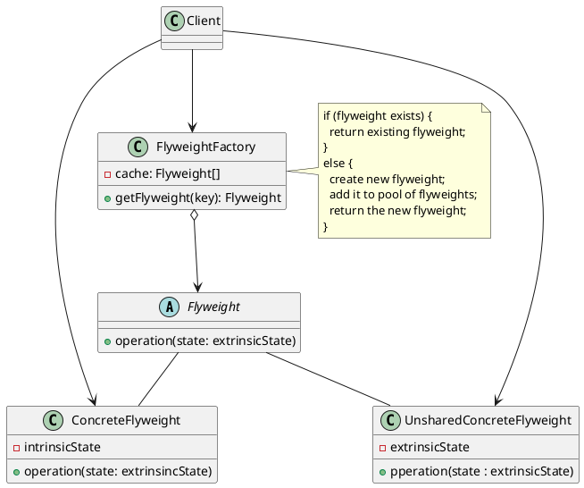

# Flyweight

[^GAMMA]
[^Shvets]
[^SourceMaking]
[^OODesign]


## Intenção

O Flyweight tem como objetivo usar o compartilhamento de forma eficiente, para dar suporte a objetos que são usados em grande quantidade.

## Também conhecido como

Peso mosca, Cache

## Motivação

Algumas aplicações requerem um grande número de objetos que possuem algum estado compartilhado entre eles, essas aplicações poderiam se beneficiar da sua estruturação em objetos em todo o seu projeto, porém, dependendo de como é implementado, esse processo pode ser inaceitavelmente caro em termos de desempenho e uso de memória.<br>
Por exemplo, os editores de texto orientados a objetos precisam criar objetos de caracteres para representar cada caractere que está no documento. Um objeto-caractere mantém informações sobre qual é o caractere, qual é sua fonte, qual é o tamanho do caractere, bem como a localização do caractere dentro do documento. Mesmo documentos de tamanhos moderados podem requerer centenas de milhares de objetos-caracteres, o que consumirá uma grande quantidade de memória, podendo incorrer num custo inaceitável em tempo de execução.<br>
Nesse caso poderiamos aderir o padrão de projeto **Flyweight**, que utilizará o conceito de estado intrínseco e extrínseco, onde o estado intrínseco é armazenado no flyweight, e consiste de informações independentes do contexto do flyweight, logo ele é a parte que pode ser compartilhada. Já o estado extrínseco, depende e varia do contexto passado pelo objetos-clientes quando necessário, portanto, não são compartilhados.<br>
Nesse exemplo o que seria armazenado no estado intrínseco seria o codigo do caractere solicitado, e no estado extrínseco seria armazenado outras informações que podem variar, como fonte, cor e outras informações que dependem do contexto que o flyweight necessita.<br>
Uma vez que o número de objetos de caracteres diferentes é muito menor que o número de caracteres do documento, o número total de objetos é 
menor do que aquele que seria usado por outra implementação. 
- Um documento no qual todos os caracteres aparecem na mesma fonte tipográfica e na mesma cor colocará algo na ordem de 100 objetos de caracteres, independente do comprimento do documento.
- E uma vez que a maioria dos documentos não usa mais do que 10 diferentes combinações de fonte-cor, esse número não crescerá muito. Dessa maneira, uma abstração de objeto se torna prática para caracteres individuais.


## Aplicabilidade

Use o padrão Flyweight quando:

- Uma aplicação precisar gerar/utilizar um grande número de objetos similares, onde esses objetos irão possuir estados duplicados que podem ser extraidos e compartilhados entre múltiplos objetos;
- Os custos de armazenamento forem altos, e isso drenar a RAM disponivel no dispositivo por causa da grande quantidade de objetos.


## Estrutura

<figure>



<figcaption>Estrutura Flyweight.</figcaption>
</figure>


## Participantes 

- **Flyweight** 
    - A classe abstrata que contém os métodos de estado extrínseco.
- **ConcreteFlyweight** 
    - A classe que contém todo o estado intrínseco e a implementação dos métodos abstratos de estado extrínseco da classe Flyweight.
- **UnsharedConcreteFlyweight** 
    - A classe onde é armazenado todo o estado extrínseco do padrão.   
- **FlyweightFactory**
    - A classe que contém o array onde são criados e gerenciados os objetos flyweight e seus métodos de chamada.   
- **Client**
    - A classe cliente faz a requisição dos objetos compartilhados e é responsável por passar os estados extrínsecos.

## Colaborações

- O `Flyweight()` possui sua parte intrínseca e extrínseca. O estado intrínseco é armazenado na classe `ConcreteFlyweight()`, já o extrínseco fica na `UnsharedConcreteFlyweight()`, e deve ser passado pelo cliente, já que dependem do contexto, quando invocam suas operações. Os clientes devem fazer a solicitação do `ConcreteFlyweight()` diretamente para a `FlyweightFactory()`, para garantir que sejam compartilhadas de forma correta.


## Consequências

O padrão Flyweight tem os seguintes benefícios e desvantagens:

- **Benefícios**
    
    - Economiza memória, já que compartilhga objetos flyweight entre os clientes
   

- **Desvantagens** 

    - Pode haver um grande custo para procurar objetos compartilhados, dependendo da quantidade e da organização dos mesmos.
    

## Implementação


## Exemplo de código

```java

```
## Usos conhecidos

- Um exemplo do uso do Flyweight é com os navegadores da Web modernos, que usam essa técnica para evitar o carregamento das mesmas imagens duas vezes. Quando o navegador carrega uma página da Web, ele percorre todas as imagens dessa página. O navegador carrega todas as novas imagens da Internet e as coloca no cache interno. Para imagens já carregadas, é criado um objeto flyweight, que possui alguns dados exclusivos, como posição na página, mas todo o resto é referenciado ao armazenado em cache.

- Outro exemplo da utilização do Flyweight é na criação de jogos, pois é necessário otimizar e economizar memória, como exemplo, em um jogo que o cenário é um planeta a ser explorado, os desenvolvedores desse jogo não iriam criar milhares de objetos(árvores,animais,minerais e etc), com isso eles utilizam o flyweight e multiplicam os objetos que podem ser compartilhados.

## Padrão relacionados

***Factory Method e Singleton*** : Flyweights geralmente são criados usando uma Factory Method (metodo de fábrica), e o singleton é aplicado a essa fábrica para que, para cada tipo ou categoria de flyweights, uma única instância seja retornada.

***State e Strategy*** : Os padrões State e Strategy são geralmente implementados como Flyweights.

## Referências

@include(../bib/bib.md)