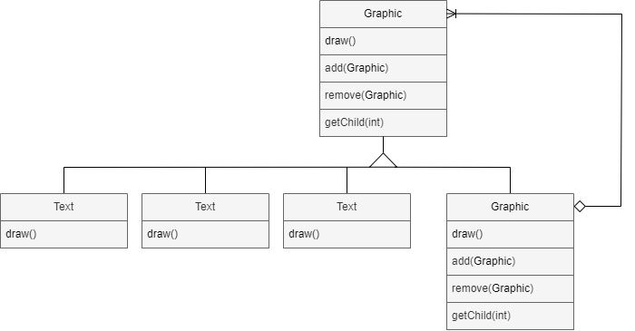
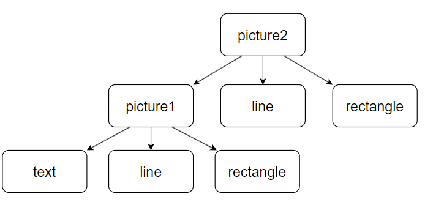
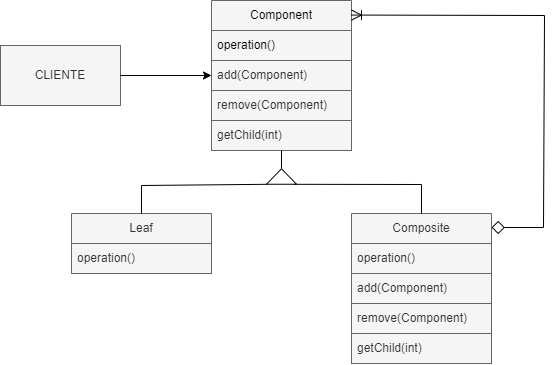
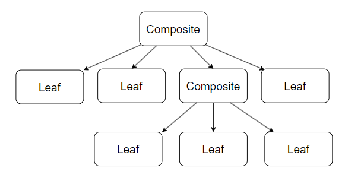

# Composite (GOF)

## Intenção 

  O Composite é um padrão de projeto estrutural que permite a composição de objetos em estruturas de árvores. Permitindo aos clientes tratarem de maneira uniforme objetos individuais e composições de objetos.
    
## Também conhecido como

Árvore de objetos

## Motivação

Aplicações gráficas permitem aos usuários construir diagramas completos a partir de componentes simples. O usuário pode agrupar componentes para formar componentes ainda maiores. Uma implementação simples poderia definir classes para primitivas gráficas, tais como Texto e Linhas, além de outras classes que funcionam como recipientes(containers) para essas primitivas.

Um problema presente nessa abordagem é que o código que usa essas classes deve tratar objetos primitivos e objetos recipientes de modo diferente, mesmo se na maioria das vezes o usuária vai tratar de forma idêntica. E distinguir a diferença entre os objetos torna a aplicação mais complexa.

<p align="center">
  
</p>

#####Código:

Criação da classe abstrata `Graphic` que representa o componente gráfico base. Possuindo o método `draw()` que deve ser implementado por todos seus filhos, sejam eles compostos ou folhas. E outros métodos que vão ser utilizados somente pelos filhos compostos.

@[code](./code/gof/composite/gofExemplo/Graphic.java)

Criação da classe concreta `Line` que estende a classe abstrata `Graphic` e representa um elemento visual.  

@[code](./code/gof/composite/gofExemplo/Line.java)

Criação da classe concreta `Rectangle` que estende a classe abstrata `Graphic` e representa um elemento visual.  

@[code](./code/gof/composite/gofExemplo/Rectangle.java)

Criação da classe concreta `Text` que estende a classe abstrata `Graphic` e representa um elemento visual.  

@[code](./code/gof/composite/gofExemplo/Text.java)

Criação da classe concreta `Picture` que estende a classe abstrata `Graphic` e representa uma imagem composta por vários componentes gráficos.

@[code](./code/gof/composite/gofExemplo/Picture.java)

Criação da classe concreta `Cliente` que contém o método `main()` e demonstra o uso dos componentes gráficos.

@[code](./code/gof/composite/gofExemplo/Cliente.java)

<p align="center">
  
</p>

## Estrutura

<p align="center">
  
</p>

Uma estrutura típica do Composite pode ser parecida com essa:

<p align="center">
  
</p>

## Participantes

- **Component** (Graphic)
    - Declara uma classe abstrata para os objetos que vão fazer parte da composição da 'árvore', implementando um comportamento padrão para todas as classes. 
- **Leaf** (Rectangle, Line, Text)
    - São os objetos 'Leaf', que são as folhas na composição da 'árvore' e uma 'Leaf' não possui filhos. Elas também definem os objetos primitivos que vão estar presente na composição.
- **Composite** (Picture)
    - Define comportamentos para os componentes que vão possuir filhos, eles tem a capacidade de armazenar os componentes filhos, que podem ser 'Leafs' ou até outros 'Composite'. Eles implementam as operações relacionadas com os filhos presentes na classe abstrata.
- **Client**
    - Realiza a manipulação de objetos na composição através da interface de Component.

## Aplicabilidade

Utilize do padrão Composite quando:  
- Quiser representar uma composição hierárquica de objetos.
- Quiser que os clientes sejam capazes de ignorar a diferença entre composições(Composite) de objetos e objetos individuais(Leaf) e tratem todos os objetos na estrutura composta de maneira uniforme.


## Colaborações

- Os clientes utilizam da classe abstrata `Component` para interagir com objetos presentes na estrutura composta. Se o receptor for um 'Leaf', a solicitação vai ser tratada diretamente e se o receptor é um 'Composite', ele vai repassar as solicitações para os seus componentes filhos('Leaf').

## Consequências

Benefícios e desvantagens do padrão Composite:

### Benefícios 

- Facilidade em criar objetos complexos por composição
- Facilidade em gerar uma hierárquia de objetos
- Facilidade em utilizar polimorfismo e recursão
- Torna simples a adição de novos tipos de elementos na estrutura, seja Composite ou Leaf vão funcionar automaticamente com as estruturas existentes e o código do cliente.
- Torna o cliente simples, pois eles podem tratar estruturas compostas e objetos individuais de maneira uniforme. E normalmente os clientes não sabem se estão tratando uma folha ou objetos composto, além de que eles não deveriam se preocupar com isso.

### Desvantagens

- Torna o projeto excessivamente genérico. A desvantagem de facilitar o acréscimo de novos componentes é que isso torna mais difícil restringir os componentes de uma composição. Algumas vezes, você deseja uma composição que tenha somente certos componentes, e com o padrão Composite você não pode confiar no sistema de tipos para garantir a obediência a essas restrições. Ao invés disso, terá que usar verificações e testes em tempo de execução. 

- A depender da estrutura, pode quebrar o princípio da segregação de interface. Objetos do tipo 'Leaf' tendem a ter métodos que não usam ou não fazem nada.


## Implementação

- 1. Realizar a certificação do modelo de sua aplicação para saber se ela pode ser representada como uma estrutura de árvore. Para isso tente quebrar o modelo em elementos simples e contêineres, lembrando que o conteiner pode conter tanto elementos simples como outros contêineres.

- 2. Declare a classe abstrata componente com uma lista de métodos que façam sentido para os componentes complexos e simples.

```java
public abstract class Componente {
    abstract String operacao1();
    abstract double operacao2();
    abstract Boolean operacao3();

    public void adicionar(Componente produto) {}
    public void remover(Componente produto) {}
}
```

- 3. Crie uma classe folha que represente elementos simples, no mesmo programa pode ter múltiplas classes folhas diferentes.

    - Representação de uma classe folha chamada `Folha1`:
        ```java
        public class Folha1 extends Componente{
            //Atributos
            //Constructor
            //Gets e Setters
            @Override
            public String operacao1() {
                //Lógica do método
            }
            @Override
            public double operacao2() {
                //Lógica do método
            }
            @Override
            public Boolean opercaon3() {
                //Lógica do método
            }
        }
        ```

    - Representação de outra classe folha chamada `Folha2`:

            ```java
            public class Folha2 extends Componente{
                //Atributos
                //Constructor
                //Gets e Setters
                @Override
                public String operacao1() {
                    //Lógica do método
                }
                @Override
                public double operacao2() {
                    //Lógica do método
                }
                @Override
                public Boolean opercaon3() {
                    //Lógica do método
                }
            }
            ```
- 4. Crie uma classe contêiner para representar elementos complexos. Nessa classe crie um vetor para armazenar referências aos sub-elementos. O vetor deve ser capaz de armazenar tanto folhas como contêineres, então certifique-se que ele foi declarado com um tipo de classe abstrata componente.

```java
public class Conteiner extends Componente {
    private List<Componente> filho = new ArrayList<>();
    //Atributos
    //Constructor
    //Gets e Setters
    @Override
    public String operacao1() {
        //Lógica do método
    }
    @Override
    public double operacao2() {
        //Lógica do método
    }
    @Override
    public Boolean opercaon3() {
        //Lógica do método
    }
}
```

- 5. Por fim, defina os métodos para adicionar e remover os elementos filhos no contêiner.

```java
public class Conteiner extends Componente {
    //...
    @Override
    public void adicionar(Componente produto) {
        filho.add(produto);
    }
    @Override
    public void remover(Componente produto) {
        filho.remove(produto);
    }
    //...
}
```

É importante ter em mente que as operações podem ser declaradas dentro da classe abstrata componente e isso viola o princópio de segregação de interface porque os métodos vão estar vazios na classe folha. Mas, o cliente será capaz de tratar todos os elementos de forma igual, mesmo ao montar a árvore.

## Exemplo de código

Considerando o cenário onde precisa ser desenvolvido um sistema para o gerenciamento de uma empresa e-commerce que vende produtos eletrônicos. A empresa vende variados tipos de eletrônicos como smartphones e tablets, cada produto possui informações específicas como nome, preço, descrição e id. Os cliente podem montar seus pacotes personalizados da maneira que quiser, contendo um ou mais produtos, independente do seu tipo. Esse pacotes podem conter outros pacotes dentro deles, formando assim a estrutura hierárquica.

Criação da classe abstrata Component, que vai conter os métodos presente em todos os objetos, sejam eles Leaf ou Composite.

@[code](./code/gof/composite/meuExemplo/Component.java)

Criação da classe concreta `Produto` que estende a classe abstrata `Component`, essa classe é o Leaf, ou seja, é um tipo primitivo que pode ser alocada em uma classe composta(Composite).

@[code](./code/gof/composite/meuExemplo/Produto.java)

Criação da classe concreta `Pacote` que estende a classe abstrata `Component`, essa classe é o Composite, ou seja, ela vai poder receber filhos. 

@[code](./code/gof/composite/meuExemplo/Pacote.java)

Criação da classe concreta `Cliente` que vai ser o código de implementação:

@[code](./code/gof/composite/meuExemplo/Cliente.java)
## Usos conhecidos

- Java AWT e Swing são baseados em Composite View, o padrão é utilizado para representar a hierarquia dos componentes gráficos.
- Composite View também é utilizado em ambiente web em que existe a composição de páginas "template" com páginas de dados. No mesmo contexto web tem a utilização do DOM, que pode representar a hierarquia de elementos em um documento, onde cada elemento pode conter outros elementos, no HTML.
- Photoshop utiliza o Composite para representar a hierarquia de camadas de uma imagem, pois cada camada pode conter outras camadas ou elementos gráficos.

## Padrão relacionados

- [Padrão Decorator]: Frequentemente usado com o padrão Composite. Quando decoradores e composições são usados juntos, eles têm normalmente uma classe-mãe comum. Assim, decoradores terão que suportar a interface de Component com operações como Add, Remove e GetChild.
- [Padrão Flyweight]: Permite compartilhar componentes, porém estes não mais podem referenciar seus pais.
- [Padrão Iterator]: Pode ser usado para percorrer os compostos.
- [Padrão Visitor]: Pode ser usado para localizar operações e comportamentos que seriam de outra forma distribuídos entre classes Composite e Leaf.

## Referências

- Gamma Erich - Padrões de Projetos - Soluções Reutilizáveis
- Otávio Miranda - Composite Teoria - Padrões de Projeto - Parte 14/45 https://www.youtube.com/watch?v=I0RqHDFQjVY&list=PLbIBj8vQhvm0VY5YrMrafWaQY2EnJ3j8H&index=15
- Otávio Miranda - Composite Prática - Padrões de Projeto - Parte 15/45 https://www.youtube.com/watch?v=VFGaqoxA_lo&list=PLbIBj8vQhvm0VY5YrMrafWaQY2EnJ3j8H&index=15
- https://sergiotaborda.wordpress.com/desenvolvimento-de-software/java/patterns/composite/#:~:text=AWT%20e%20Swing%20são%20baseados,com%20as%20páginas%20de%20dados.

<!-- @include: ../bib/bib.md -->
