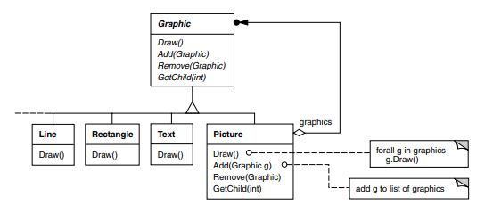
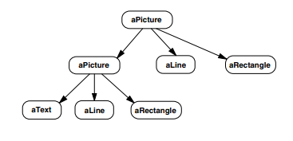
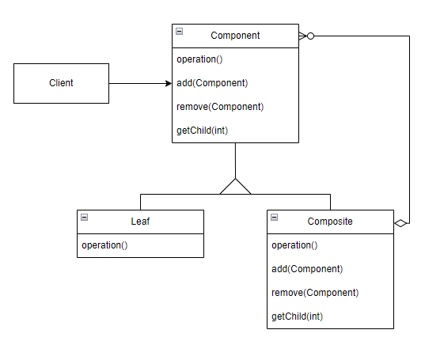
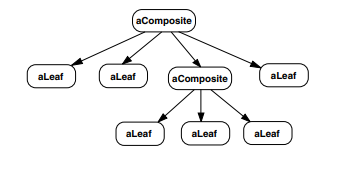

# Composite (GOF)

## Intenção 

  O Composite é um padrão de projeto estrutural que permite a composição de objetos em estruturas de árvores. Permitindo aos clientes tratarem de maneira uniforme objetos individuais e composições de objetos.
    
## Também conhecido como

Árvore de objetos

## Motivação

Aplicações gráficas permitem aos usuários construir diagramas completos a partir de componentes simples. O usuário pode agrupar componentes para formar componentes ainda maiores. Uma implementação simples poderia definir classes para primitivas gráficas, tais como Texto e Linhas, além de outras classes que funcionam como recipientes(containers) para essas primitivas.

Um problema presente nessa abordagem é que o código que usa essas classes deve tratar objetos primitivos e objetos recipientes de modo diferente, mesmo se na maioria das vezes o usuária vai tratar de forma idêntica. E distinguir a diferença entre os objetos torna a aplicação mais complexa.

<p align="center">
  
</p>

#####Código:

Criação da classe abstrata `ComponentGraphic` que representa o componente gráfico base. Possuindo o método `Draw()` que deve ser implementado por todos seus filhos, sejam eles compostos ou folhas. E outros métodos que vão ser utilizados somente pelos filhos compostos.

```java
package GofExemplo;
public abstract class ComponentGraphic {
    abstract void Draw();
    public void add(ComponentGraphic graphic) {};
    public void remove(ComponentGraphic graphic) {};
}
```

Criação da classe concreta `Leaf` que estende a classe abstrata `ComponentGraphic` e representa um elemento visual.  

```java
package GofExemplo;
public class Leaf extends ComponentGraphic{
    private String nome;
    public Leaf(String nome) {
        this.nome = nome;
    }
    @Override
    public void Draw() { /*Lógica...*/ }
    public String getNome() {
        return nome;
    }
    public void setNome(String nome) {
        this.nome = nome;
    }
    @Override
    public String toString() {
        return "Nome: " + nome;
    }
}
```

Criação da classe concreta `CompositePicture` que estende a classe abstrata `ComponentGraphic` e representa uma imagem composta por vários componentes gráficos.

```java
package GofExemplo;
import java.util.ArrayList;
import java.util.List;
public class CompositePicture extends ComponentGraphic {
    private List<ComponentGraphic> children = new ArrayList<>();
    private String nome;
    public CompositePicture(String nome) {
        this.nome = nome;
    }
    @Override
    public void Draw() { /*Lógica...*/ }
    @Override
    public void add(ComponentGraphic graphic) {
        children.add(graphic);
    }
    @Override
    public void remove(ComponentGraphic graphic) {
        children.remove(graphic);
    }
    public String getNome() {
        return nome;
    }
    public void setNome(String nome) {
        this.nome = nome;
    }
    @Override
    public String toString() {
        return "Nome: " + nome + " " + children + "";
    }
}
```

Criação da classe concreta `Cliente` que contém o método `main()` e demonstra o uso dos componentes gráficos.

```java
package GofExemplo;
public class Cliente {
    public static void main(String[] args) {
        ComponentGraphic line = new Leaf("Linha");
        ComponentGraphic rectangle = new Leaf("Retângulo");
        ComponentGraphic text = new Leaf("Texto");

        ComponentGraphic picture1 = new CompositePicture("Picture 1");
        picture1.add(text);
        picture1.add(line);
        picture1.add(rectangle);
        System.out.println(picture1);
        //Nome: Picture 1 [Nome: Linha, Nome: Retângulo, Nome: Texto]

        ComponentGraphic picture2 = new CompositePicture("Picture 2");
        picture2.add(picture1);
        picture2.add(line);
        picture2.add(rectangle);
        System.out.println(picture2);
        //Nome: Picture 2 [Nome: Picture 1 [Nome: Linha, Nome: Retângulo, Nome: Texto], Nome: Linha, Nome: Retângulo]
    }
}
```

<p align="center">
  
</p>

## Estrutura

<p align="center">
  
</p>

Uma estrutura típica do Composite pode ser parecida com essa:

<p align="center">
  
</p>

## Participantes

- **Component** (Graphic)
    - Declara uma classe abstrata para os objetos que vão fazer parte da composição da 'árvore', implementando um comportamento padrão para todas as classes. 
- **Leaf** (Rectangle, Line, Text)
    - São os objetos 'Leaf', que são as folhas na composição da 'árvore' e uma 'Leaf' não possui filhos. Elas também definem os objetos primitivos que vão estar presente na composição.
- **Composite** (Picture)
    - Define comportamentos para os componentes que vão possuir filhos, eles tem a capacidade de armazenar os componentes filhos, que podem ser 'Leafs' ou até outros 'Composite'. Eles implementam as operações relacionadas com os filhos presentes na classe abstrata.
- **Client**
    - Realiza a manipulação de objetos na composição através da interface de Component.

## Aplicabilidade

Utilize do padrão Composite quando:  
- Quiser representar uma composição hierárquica de objetos.
- Quiser que os clientes sejam capazes de ignorar a diferença entre composições(Composite) de objetos e objetos individuais(Leaf) e tratem todos os objetos na estrutura composta de maneira uniforme.


## Colaborações

- Os clientes utilizam da classe abstrata `Component` para interagir com objetos presentes na estrutura composta. Se o receptor for um 'Leaf', a solicitação vai ser tratada diretamente e se o receptor é um 'Composite', ele vai repassar as solicitações para os seus componentes filhos('Leaf').

## Consequências

Benefícios e desvantagens do padrão Composite:

### Benefícios 

- Facilidade em criar objetos complexos por composição
- Facilidade em gerar uma hierárquia de objetos
- Facilidade em utilizar polimorfismo e recursão
- Torna simples a adição de novos tipos de elementos na estrutura, seja Composite ou Leaf vão funcionar automaticamente com as estruturas existentes e o código do cliente.
- Torna o cliente simples, pois eles podem tratar estruturas compostas e objetos individuais de maneira uniforme. E normalmente os clientes não sabem se estão tratando uma folha ou objetos composto, além de que eles não deveriam se preocupar com isso.

### Desvantagens

- Torna o projeto excessivamente genérico. A desvantagem de facilitar o acréscimo de novos componentes é que isso torna mais difícil restringir os componentes de uma composição. Algumas vezes, você deseja uma composição que tenha somente certos componentes, e com o padrão Composite você não pode confiar no sistema de tipos para garantir a obediência a essas restrições. Ao invés disso, terá que usar verificações e testes em tempo de execução. 

- A depender da estrutura, pode quebrar o princípio da segregação de interface. Objetos do tipo 'Leaf' tendem a ter métodos que não usam ou não fazem nada.


## Implementação

- 1. Realizar a certificação do modelo de sua aplicação para saber se ela pode ser representada como uma estrutura de árvore. Para isso tente quebrar o modelo em elementos simples e contêineres, lembrando que o container pode conter tanto elementos simples como outros contêineres.

- 2. Declare a classe abstrata componente com uma lista de métodos que façam sentido para os componentes complexos e simples.

```java
public abstract class Componente {
    abstract String operacao1();
    abstract double operacao2();
    abstract Boolean operacao3();

    public void adicionar(Componente produto) {}
    public void remover(Componente produto) {}
}
```

- 3. Crie uma classe folha que represente elementos simples, no mesmo programa pode ter múltiplas classes folhas diferentes.

    - Representação de uma classe folha chamada `Folha1`:
        ```java
        public class Folha1 extends Componente{
            //Atributos
            //Constructor
            //Gets e Setters
            @Override
            public String operacao1() {
                //Lógica do método
            }
            @Override
            public double operacao2() {
                //Lógica do método
            }
            @Override
            public Boolean opercaon3() {
                //Lógica do método
            }
        }
        ```

    - Representação de outra classe folha chamada `Folha2`:

            ```java
            public class Folha2 extends Componente{
                //Atributos
                //Constructor
                //Gets e Setters
                @Override
                public String operacao1() {
                    //Lógica do método
                }
                @Override
                public double operacao2() {
                    //Lógica do método
                }
                @Override
                public Boolean opercaon3() {
                    //Lógica do método
                }
            }
            ```
- 4. Crie uma classe contêiner para representar elementos complexos. Nessa classe crie um vetor para armazenar referências aos sub-elementos. O vetor deve ser capaz de armazenar tanto folhas como contêineres, então certifique-se que ele foi declarado com um tipo de classe abstrata componente.

```java
public class Conteiner extends Componente {
    private List<Componente> filho = new ArrayList<>();
    //Atributos
    //Constructor
    //Gets e Setters
    @Override
    public String operacao1() {
        //Lógica do método
    }
    @Override
    public double operacao2() {
        //Lógica do método
    }
    @Override
    public Boolean opercaon3() {
        //Lógica do método
    }
}
```

- 5. Por fim, defina os métodos para adicionar e remover os elementos filhos no contêiner.

```java
public class Conteiner extends Componente {
    //...
    @Override
    public void adicionar(Componente produto) {
        filho.add(produto);
    }
    @Override
    public void remover(Componente produto) {
        filho.remove(produto);
    }
    //...
}
```

É importante ter em mente que as operações podem ser declaradas dentro da classe abstrata componente e isso viola o princópio de segregação de interface porque os métodos vão estar vazios na classe folha. Mas, o cliente será capaz de tratar todos os elementos de forma igual, mesmo ao montar a árvore.

## Exemplo de código

Considerano o cenário onde precisa ser desenvolvido um sistema para o gerenciamento de uma empresa e-commerce que vende produtos eletrônicos. A empresa vende variados tipos de eletrônicos como smartphones e tablets, cada produto possui informações específicas como nome, preço, descriçao e id. Os cliente podem montar seus pacotes personalizados da maneira que quiser, contendo um ou mais produtos, independente do seu tipo. Esse pacotes podem conter outros pacotes dentro deles, formando assim a estrutura hierárquica.

```java 
package MeuExemplo;
public abstract class Component {
    abstract double getPreco();
    abstract String getNome();
    abstract String getDescricao();
    abstract String getId();
    
    public void adicionar(Component... produtos) {}
    public void remover(Component... produtos) {}
    public Component clone() {
        return null;}
}
```

Criação da classe concreta `Produto` que estende a classe abstrata `Component`, essa classe é o Leaf, ou seja, é um tipo primitivo que pode ser alocada em uma classe composta(Composite).

```java
package MeuExemplo;

public class Produto extends Component {
    private double preco;
    private String nome;
    private String descricao;
    private String id;

    public Produto(String nome, String descricao, String id, double preco) {
        this.nome = nome;
        this.descricao = descricao;
        this.id = id;
        this.preco = preco;
    }

    @Override
    public double getPreco() {
        return preco;
    }

    @Override
    public String getNome() {
        return nome;
    }

    @Override
    public String getDescricao() {
        return descricao;
    }

    @Override
    public String getId() {
        return id;
    }

    @Override
    public Component clone() {
        return new Produto(nome, descricao, id, preco);
    }

    @Override
    public String toString() {
        return "Nome: " + nome + " - Preço: " + preco + " - ID: " + id;
    }
}
```

Criação da classe concreta `Pacote` que estende a classe abstrata `Component`, essa classe é o Composite, ou seja, ela vai poder receber filhos. 

```java 
package MeuExemplo;

import java.util.ArrayList;
import java.util.List;

public class Pacote extends Component {
    private List<Component> children = new ArrayList<>();
    private double preco;
    private String nome;
    private String descricao;
    private String id;

    public Pacote(String nome, String descricao, String id) {
        this.nome = nome;
        this.descricao = descricao;
        this.id = id;
    }

    public double getPreco() {
        double total = 0;
        for (Component child : children) {
            total += child.getPreco();
        }
        return total;
    }

    @Override
    public String getNome() {
        return nome;
    }
    
    @Override
    public String getDescricao() {
        return descricao;
    }

    @Override
    public String getId() {
        return id;
    }

    @Override
    public void adicionar(Component... produtos) {
        for (Component produto : produtos) {
            children.add(produto);
        }
    }

    @Override
    public void remover(Component... produtos) {
        for (Component produto : produtos) {
            children.remove(produto);
        }
    }

    public List<String> getNomes() {
        List<String> nomesProdutos = new ArrayList<>();
        for (Component child : children) {
            nomesProdutos.add(child.getNome());
        }
        return nomesProdutos;
    }

    public List<String> getDescricoes() {
        List<String> descricoes = new ArrayList<>();
        for (Component child : children) {
            descricoes.add(child.getDescricao());
        }
        return descricoes;
    }

    public List<String> getIds() {
        List<String> ids = new ArrayList<>();
        for (Component child : children) {
            ids.add(child.getId());
        }
        return ids;
    }

    @Override
    public Component clone() {
        Component clone = new Pacote(nome, descricao, id);
        children.forEach(
            child -> {
                clone.adicionar(child.clone());
            }
        );
        return clone();
    }

    @Override
    public String toString() {
        return "Nome: " + nome + " " + children + " - ID: " + id;
    }
}
```

Criação da classe concreta cliente que vai ser o código de implementação:

```java 
package MeuExemplo;

public class Cliente {
    public static void main(String[] args) {
        Component celular1 = new Produto("Xiaomi Redmi Note 12", "Marca: Xiaomi,\nAno: 2023,\nRAM: 4GB,\nROM: 128GB,\nProcessador: Snapdragon\n", "RN100", 1.171);
        Component celular2 = celular1.clone();
        Component celular3 = celular1.clone();

        Component pacote1 = new Pacote("Redmi Note 12", "Pacote com 3 unidades do smartphone Note 12", "RN1000");
        pacote1.adicionar(celular1, celular2, celular3);

        System.out.println(pacote1);
        //Nome: Redmi Note 12 
          //[Nome: Xiaomi Redmi Note 12 - Preço: 1.171 - ID: RN100,
          //Nome: Xiaomi Redmi Note 12 - Preço: 1.171 - ID: RN100,
          //Nome: Xiaomi Redmi Note 12 - Preço: 1.171 - ID: RN100] - ID: RN1000
        System.out.println(pacote1.getPreco());//3.513
        
        Component tablet1 = new Produto("Lenovo Tab P11 Plus", "Pacote: Lenovo,\nAno: 2021,\nRAM: 4GB,\nROM: 64GB\n", "LTPP100", 1.899);
        Component tablet2 = tablet1.clone();
        Component tablet3 = tablet1.clone();

        Component pacote2 = new Pacote("Tab P11 Plus", "Lote com 3 unidades do tablet P11", "LTPP1000");
        pacote2.adicionar(tablet1, tablet2, tablet3);

        System.out.println(pacote2);
        //Nome: Tab P11 Plus 
          //[Nome: Lenovo Tab P11 Plus - Preço: 1.899 - ID: LTPP100,
          //Nome: Lenovo Tab P11 Plus - Preço: 1.899 - ID: LTPP100,
          //Nome: Lenovo Tab P11 Plus - Preço: 1.899 - ID: LTPP100] - ID: LTPP1000
        System.out.println(pacote2.getPreco());//5.697

        Component pacote3 = new Pacote("Redmi Note 12 || Tab P11 Plus", "Pacote com 2 pacotes, um com celulares e outro com tablets, além de Redmi Note 12 indívidual", "RNLTPP100");
        Component celular4 = celular1.clone();
        pacote3.adicionar(pacote1, pacote2, celular4);

        System.out.println(pacote3);
        //Nome: Redmi Note 12 || Tab P11 Plus 
          //[Nome: Redmi Note 12 
            //[Nome: Xiaomi Redmi Note 12 - Preço: 1.171 - ID: RN100, 
            //Nome: Xiaomi Redmi Note 12 - Preço: 1.171 - ID: RN100,
            //Nome: Xiaomi Redmi Note 12 - Preço: 1.171 - ID: RN100] - ID: RN1000,
          //Nome: Tab P11 Plus 
            //[Nome: Lenovo Tab P11 Plus - Preço: 1.899 - ID: LTPP100,
            //Nome: Lenovo Tab P11 Plus - Preço: 1.899 - ID: LTPP100,
            //Nome: Lenovo Tab P11 Plus - Preço: 1.899 - ID: LTPP100] - ID: LTPP1000,
          //Nome: Xiaomi Redmi Note 12 - Preço: 1.171 - ID: RN100] - ID: RNLTPP100
        System.out.println(pacote3.getPreco());//10.381
    }
}
```

## Usos conhecidos

- Java AWT e Swing são baseados em Composite View, o padrão é utilizado para representar a hierarquia dos componentes gráficos.
- Composite View também é utilizado em ambiente web em que existe a composição de páginas "template" com páginas de dados. No mesmo contexto web tem a utilização do DOM, que pode representar a hierarquia de elementos em um documento, onde cada elemento pode conter outros elementos, no HTML.
- Photoshop utiliza o Composite para representar a hierarquia de camadas de uma imagem, pois cada camada pode conter outras camadas ou elementos gráficos.

## Padrão relacionados


- [Padrão Decorator]: É frequentemente usado com o padrão Composite. Quando decoradores e composições são usados juntos, eles têm normalmente uma classe-mãe comum. Assim, decoradores terão que suportar a interface de Component com operações como Add, Remove e GetChild.
- [Padrão Flyweight]: Permite compartilhar componentes, porém estes não mais podem referenciar seus pais.
- [Padrão Iterator]: Pode ser usado para percorrer os compostos.
- [Padrão Visitor]: Pode ser usado para localizar operações e comportamentos que seriam de outra forma distribuídos entre classes Composite e Leaf.

## Referências

- https://sergiotaborda.wordpress.com/desenvolvimento-de-software/java/patterns/composite/#:~:text=AWT%20e%20Swing%20são%20baseados,com%20as%20páginas%20de%20dados.

<!-- @include: ../bib/bib.md -->
