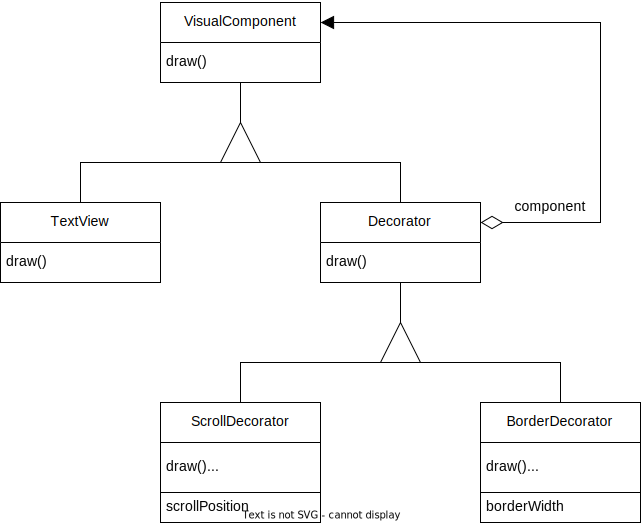
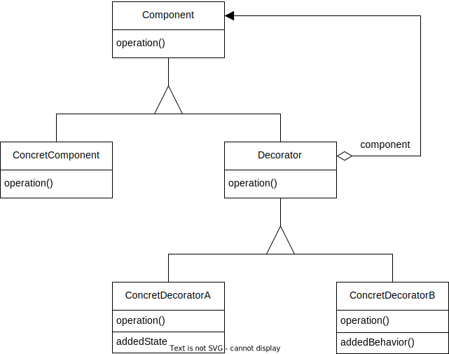
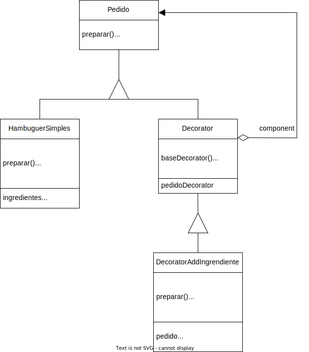

# Decorator (GOF)

## Intenção

Dinamicamente, agregar responsabilidades adicionais a um objeto. Os Decorators fornecem uma alternativa flexível ao uso de subclasses para extensão de funcionalidades.

## Também conhecido como

Wrapper

## Motivação

Em alguns momentos precisamos adicionar responsabilidades em objetos individuais, e não na classe como um todo. Por exemplo, um `toolkit` para construção de interfaces gráficas de usuário deveria permitir a adição de propriedades, como bordas ou comportamentos, como rolamento para qualquer componente da interface do usuário. 
Uma forma de adicionar responsabilidade é a herança. Herdar uma borda de uma outra classe coloca uma borda em volta de todas as instâncias de uma subclasse. Essa abordagem seria inflexível, por que a borda é feita estaticamente, um cliente não pode controlar como e quando decorar o componente com uma borda.
Uma abordagem flexível é embutir o componente em outro objeto que acrescenta a borda, o objeto que envolve o primeiro é chamado de `decorator`. O decorator segue a interface do componente que decora, de modo que sua presença é transparente para os clientes do componente. O decorator repassa solicitações para o componente, podendo executar ações adicionais (tais como desenhar uma borda) antes ou depois do repasse. A transparência permite encaixar decoradores recursivamente, desta forma permitindo um número ilimitado de responsabilidades adicionais.  
Suponha que temos um objeto `TextView` que exibe texto em uma janela, como padrão o TextView não tem barras de rolamento porque nem sempre é necessário e quando for poderemos usar um ScrollDecorator para acrescentá-las. A mesma lógica é aplicada se quisermos adicionar uma borda preta ao redor do objeto TextView, ai podemos usar um objeto BorderDecorator para está finalidade.

Estrutura do cenário:

  

Código do cenário: 

Classe abstrata `VisualComponent`, para criar um padrão de objetos que utilizaram dela. Nesse caso tem somente a classe `TextView` e a classe `Decorator`.

@[code](./code/gof/decorator/exemploGof/VisualComponent.java)

Classe `TextView` que estende a classe `VisualComponent`.

@[code](./code/gof/decorator/exemploGof/TextView.java)

Classe `Decorator` que estende a classe `VisualComponent`, essa classe pode ser interface, abstrata ou uma classe normal(utilizada no código). Essa classe vai permitir que o objeto `TextView` seja 'copiado'.

@[code](./code/gof/decorator/exemploGof/Decorator.java)

Classe `ScrollDecorator` que estende a classe `Decorator`, sendo assim a classe vai poder 'copiar' o objeto `TextView` e adicionar novos métodos, nesse caso o scroll.

@[code](./code/gof/decorator/exemploGof/ScrollDecorator.java)

Classe `ScrollPosition`, utilizada pela classe `ScrollDecorator` para definir o local em que o scroll vai ser implementado.

@[code](./code/gof/decorator/exemploGof/ScrollPosition.java)

Classe `BorderDecorator` que estende a classe `Decorator`, sendo assim a classe vai poder 'copiar' o objeto `TextView` e adicionar novos métodos, nesse caso a borda.

@[code](./code/gof/decorator/exemploGof/BorderDecorator.java)

Classe `Client`, onde ficará o código de compilação do programa.

@[code](./code/gof/decorator/exemploGof/Client.java)

## Aplicabilidade

Utilize o padrão Decorator:

- Para acrescentar novas responsabilidades em objetos individuais de forma dinâmica e transparente, ou seja, sem afetar outros objetos.
- Para responsabilidades que podem ser removidas a qualquer momento.
- Quando é complicado ou impossível estender o comportamento de um objeto usando herança.
- Prevenir quando você percebe que pode ter uma explosão de subclasses em determinada estrutura.

## Estrutura

  

## Participantes

- **Component** (VisualComponent)
  - e a interface para objetos que podem ter responsabilidades acrescentadas aos mesmos dinamicamente.
- **ConcreteComponent** (TextView)
  - define um objeto para o qual responsabilidades adicionais podem ser atribuídas.
- **Decorator** (Decorator) 
  - mantém uma referência para um objeto Component e define uma interface que segue a interface de Component.
- **ConcreteDecorator** (BorderDecorator, ScrollDecorator)
  - acrescenta responsabilidades ao componente.

## Colaborações

  - Decorator repassa solicitações para o seu objeto Component. Opcionalmente, ele pode executar operações adicionais antes e depois de repassar a solicitação.

## Consequências

### Vantagens

- *Maior flexibilidade do que a herança estática.* O padrão `Decorator` fornece uma maneira mais flexível de acrescentar responsabilidades a objetos do que pode ser feito com herança estática (múltipla).
- *Evita classes sobrecarregadas de características na parte superior da hierarquia.* Um `Decorator` oferece uma abordagem do tipo “use quando for necessário” para adição de responsabilidades. Em vez de tentar suportar todas as características previsíveis em uma classe complexa e customizada, você pode definir uma classe simples e acrescentar funcionalidade de modo incremental com objetos `Decorator`. 
- *É possível decorar um objeto já decorado.* Um `Decorator` pode ser envolto por outros `Decorator`, adicionando mais funcionalidades (camadas).

### Desvantagens

- *Grande quantidade de pequenos objetos.* Um projeto que usa o `Decorator` frequentemente resulta em sistemas compostos por uma grande quantidade de pequenos objetos parecidos.
- Quanto mais `Decorators` em camadas, mais complexo seu código vai se tornar.

## Implementação

1. Certifique-se que seu domínio de negócio pode ser representado como um componente primário com múltiplas camadas opcionais sobre ele.
2. Descubra quais métodos são comuns tanto para o componente primário e para as camadas opcionais. Crie uma interface componente e declare aqueles métodos ali.
3. Crie uma classe componente concreta e defina o comportamento base nela.
4. Crie uma classe decorador base. Ela deve ter um campo para armazenar uma referência ao objeto envolvido. O campo deve ser declarado com o tipo da interface componente para permitir uma ligação entre os componentes concretos e decoradores. O decorador base deve delegar todo o trabalho para o objeto envolvido.
5. Certifique-se que todas as classes implementam a interface componente.
6. Crie decoradores concretos estendendo-os a partir do decorador base. Um decorador concreto deve executar seu comportamento antes ou depois da chamada para o método pai (que
sempre delega para o objeto envolvido).
7. O código cliente deve ser responsável por criar decoradores e compô-los do jeito que o cliente precisa.

## Exemplo de código

O código a seguir é um exemplo da utilização do padrão Decorator, nele contém a implementaçao de um sistema de pedidos de hambúrgueres. O cenário envolve a criação de `HamburguerSimples` com a possibilidade de adicionar ingredientes extras. 

  

@[code](./code/gof/decorator/meuExemplo/Client.java)

@[code](./code/gof/decorator/meuExemplo/Pedido.java)

@[code](./code/gof/decorator/meuExemplo/Decorator.java)

@[code](./code/gof/decorator/meuExemplo/HamburguerSimples.java)

@[code](./code/gof/decorator/meuExemplo/DecoratorAddIngrediente.java)

## Usos conhecidos

- Editores de texto (Microsoft Word, LibreOffice, Google Docs...), utilizam o decorator para adicionar funcionalidades de formatação ao texto. Exemplo, decoradores para adicionar negrito, itálico, sublinha e entre outros.
- Frameworks de Interface Gráfica do Usuário (Swing e Windows Forms), utilizam o decorator para adicionar comportamentos adicionais aos componentes de interface ao usuário. Exemplo, decoradores para adicionar bordas, sombras, botões e entre outros.

## Padrão relacionados

- [Adapter]: Um padrão Decorator é diferente de um padrão Adapter no sentido de que um Decorator somente muda as responsabilidades de um objeto, não a sua interface, já um Adapter dará a um objeto uma interface completamente nova.
- [Composite]: Um padrão Decorator pode ser visto como um padrão Composite degenerado com somente um componente, um Decorator acrescenta responsabilidades adicionais, ele não se destina a agregação de objetos.
- [Strategy]: Um padrão Decorator permite mudar a superfície de um objeto, um padrão Strategy permite mudar o seu interior. Portanto, essas são duas maneiras alternativas de mudar um objeto.

## Referências 

- Mergulho nos Padrões de Projeto
- Gamma Erich - Padrões de Projetos - Soluções Reutilizáveis
<!-- @include: ../bib/bib.md -->
