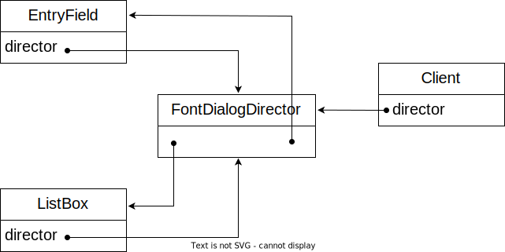
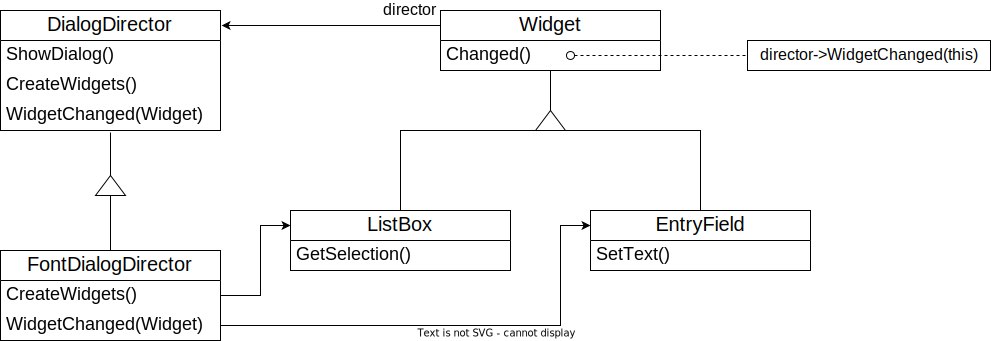
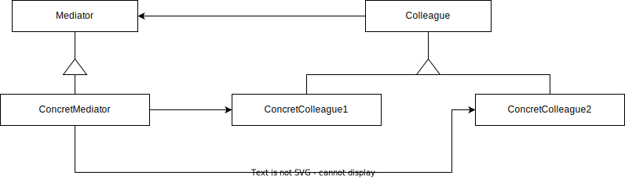
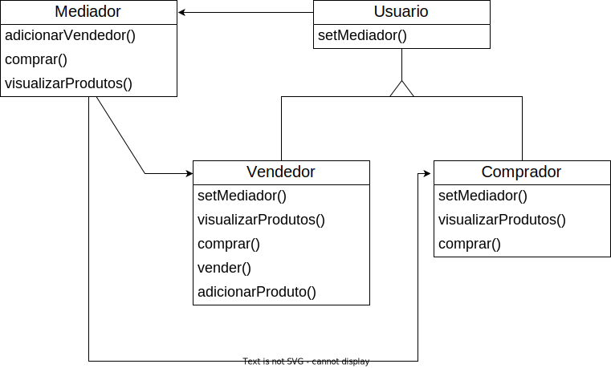

# Mediator (GOF)

## Intenção 

Definir um objeto que encapsula a forma como um conjunto de objetos interage. O Mediator promove o acoplamento fraco ao evitar que os objetos se refiram uns aos outros explicitamente e permite variar suas interações independentemente.

## Também conhecido como

Intermediary

## Motivação

Um projeto orientado a objetos distribui comportamentos entre vários objetos, esta distribuição pode resultar em uma estrutura com muitas conexões entre eles e no pior cenário, cada objeto acaba tendo conhecimento sobre todos os outros. Embora particionar o sistema em vários objetos melhore a sua reusabilidade, a criação de muitas interconexões tende a reduzir novamente. Muitas interconexões tornam menos provável que um objeto possa funcionar sem o apoio do outro, onde o sistema funciona como se fosse monolítico. 
Pode ser difícil mudar o comportamento do sistema de maneira significativa, uma vez que o comportamento está distribuído entre muitos objetos. Com isso, você pode ser forçado a definir muitas subclasses para customizar e adaptar o comportamento do sistema.
Você pode evitar esses problemas encapsulando o comportamento coletivo em um objeto `mediator`, ele será responsável pelo controle e coordenação das interações de um grupo de objetos. O mediador funciona como um intermediário que evita que os objetos do grupo referenciem uns aos outros explicitamente, os objetos conhecem apenas seu mediador.
Por exemplo, `FontDialogDirector` pode ser um mediador entre os widgets numa caixa de diálogo. Um objeto `FontDialogDirector` conhece os widgets de um diálogo e coordena sua interação. Ele funciona como um centro concentrador de comunicações para os widgets:

  

Como a abstração FontDialogDirector pode ser integrada em uma biblioteca de classes:

  

@[code](./code/gof/mediator/gofExemplo/DialogDirector.java)

@[code](./code/gof/mediator/gofExemplo/FontDialogDirector.java)

@[code](./code/gof/mediator/gofExemplo/Widget.java)

@[code](./code/gof/mediator/gofExemplo/ListBox.java)

@[code](./code/gof/mediator/gofExemplo/EntryField.java)

## Estrutura

  

## Participantes

- **Mediator**(DialogDirector)
  - define uma interface para comunicação com objetos de classe `Colleague`.
- **ConcretMediator**(FontDialogDirector)
  - implementa comportamento cooperativo através da coordenação de objetos de classe `Colleague`.
  - conhece e mantém seus colegas.
- **Colleague classes**(ListBox, EntryField)
  - cada classe `Collegue` conhece seu objeto `Mediator` de outra forma.
  - cada colega se comunica com o seu mediador sempre que, de outra forma, teria que se comunicar com outro colega.

## Aplicabilidade

- Utilize o `Mediator` quando é difícil mudar algumas das classes porque elas estão firmemente acopladas a várias outras classes. O padrão permite extrair todas as relações entre classes para uma classe separada.

- Utilize o `Mediator` quando um conjunto de objetos se comunica de maneiras bem definidas, porém complexas. As interdependências resultantes são desestruturadas e difíceis de entender.

- Utilize o `Mediator` quando a reutilização de um objeto é difícil porque ele referencia e se comunica com muitos outros objetos.

- Utilize o `Mediator` quando você utilizar um monte de subclasses para componentes, apenas para reutilizar algum comportamento básico em vários contextos. 

## Colaborações

- Colegas enviam e recebem solicitações de um objeto Mediator. O mediador implementa comportamento cooperativo pelo direcionamento das solicitações para os colegas apropriados.

## Consequências

### Benefícios 

**1. Limita o uso de subclasses:** O mediador localiza comportamentos que estariam distribuídos entre alguns objetos. Após isso é necessário a introdução das subclasses somente no `Mediator`, as classes `Colleague` podem ser reutilizadas como estão.  

**2. Desaclopa colegas:** O mediador permite um acoplamentos fraco entre colegas. Você pode variar e reutilizar as classes Colleage  e Mediator independentemente.

**3. Simplifica o protocolo dos objetos:** O mediador substitui interações muito-para-muitos por interações um-para-muitos entre o mediador e seus colegas. Relacionamentos um-para-muitos são fáceis de compreender, manter e estender. 

**4. Ele abstrai a maneira como os objetos cooperam:** Tornando a mediação um conceito independente e encapsulando-a em um objeto, permite focalizar na maneira como os objetos interagem independente do seu comportamento individual. Iss pode ajudar a esclarecer como os  objetos interagem em um sistema.

### Desvantagens

**1. Ele centraliza o controle:** O `Mediator` troca a complexidade de interação pela complexidade no mediador. Porque um mediador encapsula protocolos, pode se tornar mais complexo do que qualquer dos colegas individuais. Isso pode tornar o mediador um monólito difícil de manter.

## Implementação

- Omissão da classe abstrata `Mediator`. Quando não há necessidade de definir uma classe abstrata `Mediator` quando os colegas trabalham apenas com um mediador.

- Comunicação Colleague-Mediator. Colegas têm que se comunicar com o seu mediador quando ocorre um evento de interesse.

- Componentes com referência ao objeto mediador. Essa conexão é geralmente estabelecida no construtor do componente, onde o objeto mediador é passado como um argumento.

## Exemplo de código

Considerando um cenário em que temos vendedores e compradores de produtos, tipo o Mercado Livre, Shein, Shopee e entre outros marketplaces. Ambos os tipos de usuários acabam realizando uma comunicação entre eles, que é a venda do produto de um para o outro. Sendo assim podemos utilizar o padrão `Mediator` para tornar essa comunicação mais organizada e criar menos dependencia entre os objetos envolvidos. Ele vai atuar como um mediador central, permitindo que os vendedores e compradores se comuniquem indiretamente.

  

Classe `Produto`:

@[code](./code/gof/mediator/meuExemplo/Produto.java)

Classe `Mediador`: 

@[code](./code/gof/mediator/meuExemplo/Mediador.java)

Classe `Vendedor`: 

@[code](./code/gof/mediator/meuExemplo/Vendedor.java)

Classe `Comprador`: 

@[code](./code/gof/mediator/meuExemplo/Comprador.java)

Classe `Cliente`: 

@[code](./code/gof/mediator/meuExemplo/Cliente.java)

## Usos conhecidos

- **Jogos multiplayer:** Nesses jogos onde vários jogadores interagem entre si, o `Mediator` pode ser usado para mediar as ações dos jogadores com o servidor do jogo, que por sua vez os distribui para os jogadores relevantes.

- **Comunicação em tempo real:** Quando várias pessoas precisam se comunicar em tempo real, o`Mediator` pode gerenciar a troca de mensagens entre as pessoas, permitindo essa conexão sem eles terem conhecimento direto um do outro.

## Padrão relacionados

**Padrão Façade:** O `Façade` é utilizado para fornecer uma interface simplificada para um subsistema complexo, encapsulando as complexidades internas e fornecendo uma única interface de alto nível. Em conjunto com o `Mediator`, o `Façade` pode ser um ponto de entrada para o sistema e o `Mediator` pode ser usado para coordenar a comunicação com os diferentes componentes do subsistema.

**Padrão Observer** O `Observer` define uma relação de um-para-muitos entre objetos, onde um objeto chamado "subject" mantém uma lista de objetos "observers" que dependem dele. Quando o estado do subject muda, ele notifica automaticamente todos os observers registrados. Essa notificação pode ser feita através do Mediator, onde o Mediator atua como o subject para todos os objetos relacionados.

## Referências

- Gamma Erich - Padrões de Projetos - Soluções Reutilizáveis
- Otávio Miranda - Mediator Teoria - Padrões de Projeto - Parte 35/45 https://www.youtube.com/watch?v=fb7NrdCo4Ko
- Otávio Miranda - Mediator Prática - Padrões de Projeto - Parte 36/45 https://www.youtube.com/watch?v=LogAsgJSXBw