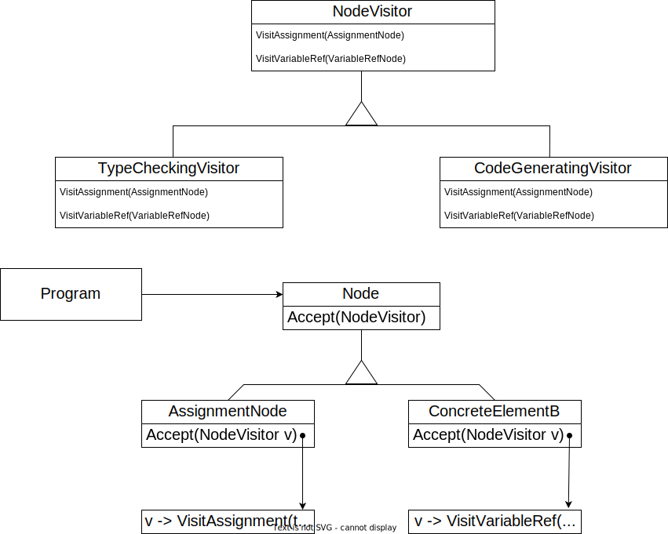

# Visitor (GOF)

## Intenção 

Representar uma operação a ser executada nos elementos de uma estrutura de objetos. `Visitor` permite definir uma nova operação sem mudar as classes dos elementos sobre os quais opera.

## Também conhecido como

Visitor

## Motivação

Um compilador que representa programas como árvores sintáticas abstratas, necessita executar operações nas árvores sintáticas abstratas para análises 'semânticas estáticas', como verificar se todas as variáveis estão definidas e depois vai gerar um código executável. Assim, poderá definir operações para verificação de tipos, otimização de código, análise de fluxo, verificação se as variáveis receberam valores antes de serem usadas, e assim por diante. 
O problema aqui é que distribuir todas essas operações pelas várias classes-nó conduz a um sistema difícil de compreender, manter e mudar. Será confuso ter o código para verificação de tipos misturado com o código para pretty-printing ou para análise de fluxo. Seria melhor se cada nova operação pudesse ser acrescentada separadamente, e as classes de nós fossem independentes dasoperações que se aplicam a elas.
Podemos ter as duas coisas empacotando as operações relacionadas de cada classe num objeto separado, chamado um visitor (visitante), e passando para ele elementos da árvore sintática abstrata à medida que a mesma é percorrida. Quando um elemento “aceita” o visitante, envia uma solicitação para o visitante que codifica a classe do elemento. Ela também inclui o elemento como argumento. O visitante então executará a operação para aquele elemento, operação que costumava estar na classe do elemento.

  

@[code](./code/gof/visitor/gofExemplo/NodeVisitor.java)

@[code](./code/gof/visitor/gofExemplo/TypeCheckingVisitor.java)

@[code](./code/gof/visitor/gofExemplo/CodeGeneratingVisitor.java)

@[code](./code/gof/visitor/gofExemplo/Node.java)

@[code](./code/gof/visitor/gofExemplo/AssignmentNode.java)

@[code](./code/gof/visitor/gofExemplo/VariableRefNode.java)

## Estrutura

  

## Participantes

## Aplicabilidade

- Utilize `Visitor` quando quiser adicionar novas operações em uma estrutura de objetos que contém várias classes com métodos e comportamentos diferentes, devido às suas interfaces específicas.

- Utilize `Visitor` quando a estrutura do objeto é compartilhada por muitas aplicações diferentes, o Visitor oferece flexibilidade para adicionar operações apenas nas aplicações que realmente as necessitam.

- Utilize `Visitor` quando as classes que definem a estrutura do objeto raramente mudam, porém, você freqüentemente deseja definir novas operações sobre a estrutura. A mudança das classes da estrutura do objeto requer a redefinição da interface para todos os visitantes, o que é potencialmente oneroso. Se as classes da estrutura do objeto mudam com freqüência, provavelmente é melhor definir as operações nessas classes.

## Colaborações

-  Um clienteque usa o padrão `Visitor` deve criar um objeto `ConcreteVisitor` e então percorrer a estrutura do objeto, visitando cada elemento com esse `Visitor`.

- Quando um elemento é visitado, chama a operação de `Visitor` que corresponde à sua classe. O elemento fornece a si mesmo como argumento para essa operação, para permitir ao visitante acessar seu estado, se necessário.

## Consequências

### Benefícios 

- `Visitor` torna fácil a adição de novas operações. Os `Visitors` tornam fácil acrescentar operações que dependem dos componentes de objetos complexos. Você pode definir uma nova operação sobre uma estrutura de objetos simplesmente acrescentando um novo visitante.

- Um visitante reúne operações relacionadas e separa as operações não-relacionadas. O comportamento relacionado não é espalhado pelas classes que definem a estrutura do objeto; ele está localizado em um visitante.

- O `Visitor` pode visitar objetos que não compartilham uma mesma classe-mãe. Você pode acrescentar qualquer tipo de objeto à interface de um `Visitor`.

- Os `Visitors` podem acumular estados à medida que visitam cada elemento na estrutura do objeto. Sem um visitante, estes estados seriam passados como argumentos extras para as operações que executam o percurso, ou eles poderiam aparecer como variáveis globais.

### Desvantagens

- É difícil acrescentar novas classes ConcreteElement. O padrão `Visitor` torna difícil acrescentar novas subclasses de Element. Cada novo ConcreteElement dá origem a uma nova operação abstrata em `Visitor` e uma correspondente implementação em cada classe `ConcreteVisitor`.

-  A abordagem do padrão `Visitor` assume que a interface de ConcreteElement é poderosa o suficiente para permitir aos visitantes executarem o seu trabalho. Como resultado, o padrão freqüentemente força a fornecer operações públicas que acessam o estado interno de um elemento, o que pode comprometer seu encapsulamento.

## Implementação

- Cada estrutura de objeto terá uma classe `Visitor` associada. Essa classe abstrata visitante declara uma operação `VisitConcreteElement` para cada classe de `ConcreteElement` que define a estrutura do objeto.

- Cada classe de `ConcreteElement` implementa uma operação `Accept` que chama a correspondente operação `Visit`... no visitante para aquele `ConcreteElement`.

- Passo a passo
  1.  Declare a interface da visitante com um conjunto de métodos “visitando”, um para cada classe elemento concreta que existe no programa.
  2.  Declare a interface elemento. Se você está trabalhando com uma hierarquia de classes elemento existente, adicione o método de “aceitação” para a classe base da hierarquia. Esse método deve aceitar um objeto visitante como um argumento.
  3.  Implemente os métodos de aceitação em todas as classes elemento concretas. Esses métodos devem simplesmente redirecionar a chamada para um método visitante no objeto visitante que está vindo e que coincide com a classe do elemento atual.
  4. As classes elemento devem trabalhar apenas com visitantes através da interface do visitante. Os visitantes, contudo, devem estar cientes de todas as classes elemento concretas referenciadas como tipos de parâmetros dos métodos visitantes.
  5. Para cada comportamento que não possa ser implementado dentro da hierarquia do elemento, crie uma nova classe visitante concreta e implemente todos os métodos visitantes.
  6. O cliente deve criar objetos visitantes e passá-los para os elementos através dos métodos de “aceitação”.

## Exemplo de código

## Usos conhecidos

- **Editores de texto:** Utilizam o padrão `Visitor` para realizar operações em diferentes elementos da estrutura de um documento, como imagens, parágrafos, tabelas e entre outros elementos presentes em editores de texto. 

- **Sistema de renderização gráfica:** Utilizam o padrão `Visitor` para percorrer estruturas de obketos gráficos e realizar operações específicas em cada um deles, como transformações geométricas.

## Padrão relacionados

**Padrão Composite:** Os `Visitors` podem ser usados para aplicar uma operação sobre uma estrutura de objetos definida pelo padrão Composite.

**Padrão Interpreter:** O `Visitor` pode ser aplicado para efetuar a interpretação.

## Referências
