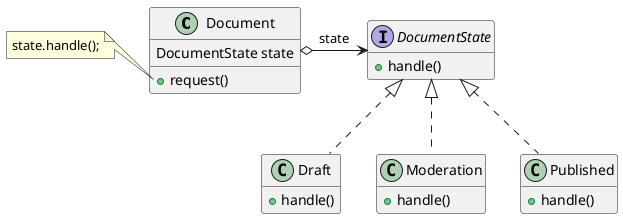
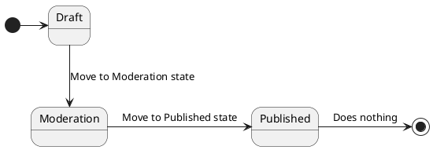
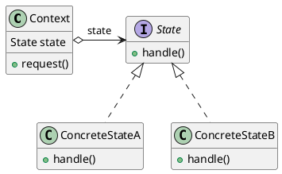
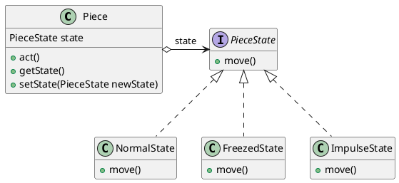

# State (GOF)

[^GAMMA]

## Intenção
A intenção do padrão State é permitir que um objeto altere seu comportamento quando o seu estado interno muda. Isso permite que o objeto pareça ter uma classe diferente em diferentes momentos.

## Também conhecido como
 - Objects for States
 - Estado (em português)

## Motivação
Imagine que nós temos uma classe `Document`. Um documento pode estar em um de três estados: Rascunho, Moderação e Publicado. O método publicar do documento funciona um pouco diferente em cada estado:

 - No Rascunho, ele move o documento para a moderação.
 - Na Moderação ele torna o documento público, mas apenas se o usuário atual é um administrador.
 - No Publicado ele não faz nada.

 Em muitos casos, como este, isso resulta em uma lógica condicional que verifica o estado atual do objeto e executa diferentes ações com base nesse estado.

 Apesar destes estados serem finitos, num ambiente com muitos possiveis estados, a lógica condicional a ser realizada cresce expoencialmente, com isso o problema tende a ficar maior a medida que o projeto evolui. É muito difícil prever todos os possíveis estados e transições no estágio inicial de projeto.


 O padrão State sugere que você crie novas classes para todos os estados possíveis de um objeto e extraia todos os comportamentos específicos de estados para dentro dessas classes. Ao invés de implementar todos os comportamentos por conta própria, o objeto original, chamado contexto, armazena uma referência para um dos objetos de estado que representa seu estado atual, e delega todo o trabalho relacionado aos estados para aquele objeto.


<figure>



<figcaption>Exemplo State.</figcaption>
</figure>

Para fazer a transição do contexto para outro estado, é possivel substituir o objeto do estado ativo por outro objeto que represente o novo estado. Isso é possível somente se todas as classes de estado seguirem a mesma interface e o próprio contexto funcione com esses objetos através daquela interface.


Nota: Essa estrutura pode ser parecida com o padrão [Strategy](/04_Strategy.md), mas há uma diferença chave. No padrão State, os estados em particular podem estar cientes de cada um e iniciar transições de um estado para outro, enquanto que estratégias quase nunca sabem sobre as outras estratégias.

Já que os estados direcionam as transições de um para o outro, aqui está um diagrama de estados para melhor entendimento do exemplo:

<figure>



<figcaption>Diagrama de estados.</figcaption>
</figure>

O círculo preenchido a esquerda do diagrama representa o início do fluxo dos estados e o círculo somente com o centro preenchido a direita do diagrama representa o final do fluxo dos estados.


## Aplicabilidade

Use o padrão **State** quando:

- Quando o comportamento de um objeto depende do seu estado e ele pode mudar seu comportamento em tempo de execução, dependendo desse estado;

- Quando as operações têm comandos condicionais grandes, de várias alternativas, que dependem do estado do objeto;

- Quando o número de estados é muito grande e os códigos de estado específicos mudam com frequência;


## Estrutura

<figure>



<figcaption>Estrutura State.</figcaption>
</figure>


## Participantes

- **Context** (Document)
    - define a interface de interesse para os clientes;
    - mantém uma instância de State que define o estado atual;
- **State** (DocumentState)
    - define uma interface para encapsulamento associado com um determinado estado do Context;
- **ConcreteState** (Draft, Moderation, Published)
    - cada subclasse implementa um comportamento associado com um estado do Context;


## Colaborações

 - Context delega solicitações específicas de estados para o objeto atual State.
 - Um contexto pode passar a si próprio como um argumento para o objeto State que trata a solicitação. Isso permite ao objeto State acessar o contexto, se necessário.

## Consequências

O padrão State tem os seguintes benefícios e desvantagens:

### Benefícios 
1.  Coloca todo o comportamento específico associado com um estado particular em um objeto.

2.  Ao utilizar objetos separados para estados diferentes, as transições de estado ficam mais claras.

3.  Possibilita a adição de novos estados, sem modificar as outras classes de estado ou contexto.

4. Torna possivel o compartilhamento de objetos state, se os objetos state não possuem variáveis de instância, então contextos podem compartilhar um objeto State. (Quando estados são compartilhados dessa maneira, eles são essencialmente [Flyweights](/XX_Flyweight.md) sem estado intrínseco, somente comportamento).
 

### Desvantagens 

1. Aumenta consideravelmente o número de classes e espalha a lógica de comportamentos.

## Implementação

Eis um exemplo para representar a implementação do padrão State em java:

```java
public interface State {
  /// Define a interface do estado.
  abstract void handle();
}
```

```java
public class ContreteStateA implements State {
  /// Define a implementação concreta do estado.
  public void handle(){
    // Faz algo.
  };
}
```

```java
public class Context {
  /// Guarda uma instância do estado atual.
  public State state;
 
  public void request(){
    state.handle();
  };
}
```


## Exemplo de código

Digamos que você quer representar o movimento das peças de um jogo de tabuleiro, onde existem diferentes formas de movimentação de acordo com as casas. Para representar o comportamento especifico das areas, o padrão State ajuda a separar os possiveis estados e compartamentos.

Veja a seguir um UML, seguido do código deste exemplo utilizando o padrão State:

<figure>


<figcaption>Estados das peças utilizando o padrão State.</figcaption>
</figure>

Definição da peça:
```java
public class Piece {
  /// Define a classe da peça

  private PieceState state;

  public int act(int movement){
    return state.move(movement)
  };


  public PieceState getState(){
    return state;
  }

  public void setState(PieceState newState){
    this.state = newState;
  }
}
```


Código da interface:

```java
public interface PieceState {
  /// Define a interface do estado.
  abstract int move(int movement);
}
```

Exemplos de `implements`:

```java
public class freezedState implements PieceState {
  /// Define a implementação concreta do estado.
  public int move(int movement){
    return 0;
  };
}
```

```java
public class ImpulseState implements PieceState {
  /// Define a implementação concreta do estado.
  public int move(int movement){
    return (movement + 4);
  };
}
```

Com essas implementações, o código cliente ficaria deste jeito:

```java
public class Client{
  public static void main(String[] args) {
    ///  chosenPiece representa a peça escolhida pelo jogador para realizar a ação,
    ///  neste caso a peça já estava dentro da lista de peças.
	  Piece chosenPiece = pieces[10];

    ///  chosenPiece.state está em ImpulseState.
    System.out.println(chosenPiece.getState());
    
    /// O código do cliente passa o ultimo número que foi rolado no dado, no caso deste exemplo: 5.
    movement = chosenPiece.act(dice.lastRolled);

    /// O movimento final da peça foi 9.
    System.out.println(movement);

    // Respectivas saídas:
    // ImpulseState
    // 9
  }
}
```

Se logo após este movimento a peça fosse parar em uma área congelada, iria assumir o estado de congelado ```FreezedState```, através da função ```setState()```, e então o movimento final dela seria 0, pois o estado altera diretamente na quantidade de movimentos que ela pode fazer. Assim o padrão state permite a adição de quantos estados forem necessários para satisfazer as condições.

## Usos conhecidos

**Lifecycle no Java**: O padrão **State** é utilizado na Função execute em (javax.faces.lifecycle), o método executa todas as fases de processamento do ciclo de vida dentro de um contexto dado.[^JavaLifeCycleExecute]

## Padrão relacionados
[Strategy](/posts/04_Strategy.md): Como mencionado anteriormente, o padrão **Strategy**, é parecido e **State** pode ser um considerado uma extensão dele. Ambos padrões são baseados em composição: eles mudam o comportamento do contexto ao delegar algum trabalho para objetos auxiliares. O Strategy faz esses objetos serem completamente independentes e alheios entre si. Contudo, o State não restringe dependências entre estados concretos, permitindo que eles alterem o estado do contexto à vontade.

## Referências

<!-- @include: ../bib/bib.md -->