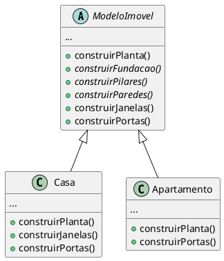

# Template Method

[^GAMMA]


## Intenção
O template method tem como objetivo definir o esqueleto de um algortimo em uma operação, que poderá ser utilizado por uma subclasse.


## Motivação
Um exemplo em que podemos precisar usar o template method, na criação de um algoritmo para construção de imóveis, onde as etapas que precisam ser executadas podem ser comuns para varios tipos de imóveis, como por exemplo a construção da fundação, dos pilares e das paredes, entre outras coisas, com isso seria necessario copiar o codigo e colar em toda criação de um imóvel, seja ele qual fosse, isso levaria tempo e também deixaria a estrutura do codigo bastante "poluída", sem falar que isso não permitiria um bom controle sobre o que o cliente está tentando sobrescrever no algoritmo.
Podemos então utilizar o template method, com eles definimos o esqueleto que poderá ser reutilizado em todas as outras classes que tem o algoritmo igual ao da superclasse, com isso será poupado bastante tempo, e será possivel controlar o que as subclasses podem ou não sobrescrever. 

<figure>


<figcaption>Exemplo Template Method.</figcaption>
</figure>

## Aplicabilidade

Use o padrão Template Method quando:

- Tiver várias classes que contém algortimos quase idênticos, com apenas algumas diferenças menores.
- Quiser implementar as partes que não variam de um algoritimo uma vez, e deixar que as subclasses implementem o comportamento que pode variar.
- Quiser controlar extensões de subclasses.


## Estrutura

<figure>

```plantuml
abstract class  "AbstractClass"{
 ...
 +templateMethod()
 +operacao1()
 +operacao2()
 +operacao3()
 +operacao4()
}


class ConcreteClass{
 ...
 +operacao2()
 +operacao3()
}


AbstractClass ^-- ConcreteClass
@enduml
```

<figcaption>Estrutura Template Method.</figcaption>
</figure>


## Participantes 

- **AbstractClass** (ModeloImovel)
    - A classe abstrata implementa um método-template que define o esqueleto de um algoritmo, e também define operações primitivas abstratas, que as subclasses concretas definem para implementar passos de um algoritmo.
- **ConcreteClass** (Casa, Apartamento)
    - Essa classe é responsavel por implementar as operações primitivas para executarem os passos específicos do algoritmo da subclasse. 

## Colaborações

- O método-template que é definido pela `AbstractClass` invoca operações primitivas, como também operações definidas em `AbstractClass` ou em outros objetos. Assim a `ConcreteClass` depende da `AbstractClass` para implementar os passos que não variam do algoritmo.


## Consequências 

O padrão Template Method tem os seguintes benefícios e desvantagens: [^REFACTORING_GURU]

- **Benefícios**
    
    - Evita duplicação de código e o mantém mais limpo.
    - Deixa clientes sobrescrever apenas certas partes de um algoritmo grande, tornando-os menos afetados por mudanças que acontece por outras partes do algoritmo.
    - É facil de entender e aplicar.
   

- **Desvantagens** 

    - Tendem a ser mais difíceis de se manter quanto mais etapas eles tiverem.
    
    

## Implementação
Um exemplo de implementação, é na criação de jogos de tabuleiro, os jogos de tabuleiro tem uma estrutura padrão, como a definição das peças, do tabuleiro, das cores e etc, com isso podemos usar um template method para criar o modelo de jogo de tabuleiro, e varias outras classes de jogos do mesmo gênero podem utiliza-la, sobrescrevendo o que for necessário e possível para adequear as suas necessidades.
Podemos visualizar abaixo o codigo dessa implementação. 


## Exemplo de código
Na implementação citada acima, a classe abstrata seria representada assim: 

@[code](./code/gof/template_method/templateJogoTabuleiro.java)

e as demais classes concretas, assim:

@[code](./code/gof/template_method/jogoXadrez.java)
@[code](./code/gof/template_method/jogoSelva.java)

## Usos conhecidos

O template method pode ser encontrado em quase todas as classes abstratas.

## Padrão relacionados 

***Strategy*** : O template method usa a herança para variar parte de um algoritmo, já o strategy é baseado em composição, para variar o algoritimo inteiro. O Template Method funciona a nível de classe, então é estático. O Strategy trabalha a nível de objeto, permitindo a troca de comportamentos durante a execução.

***Factory Method*** : O template method costuma chamar com frequencia as factory methods. 
[^REFACTORING_GURU]

## Referências

@include(../bib/bib.md)