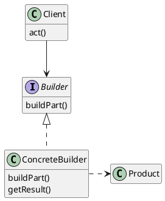
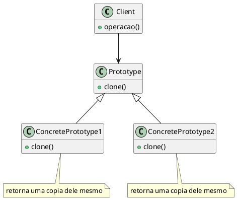
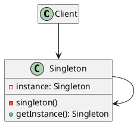
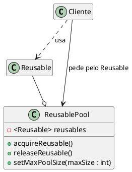
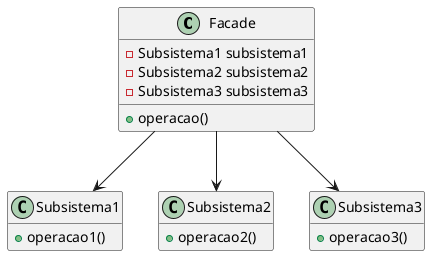
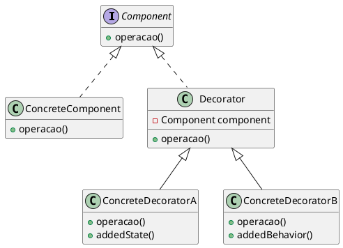
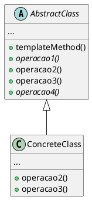
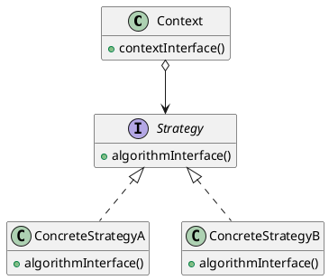
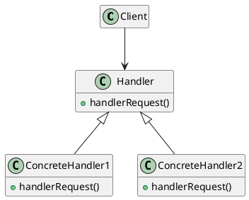
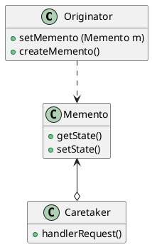

# Padrões de projeto para serem utilizados em jogos de tabuleiro

## Padrões criacionais 
- ### Builder
#### Intenção
Separar a construção de um objeto complexo da sua representação de modo que o mesmo processo de construção possa criar diferentes representações.
#### Estrutura

<figure>


<figcaption>Estrutura Builder.</figcaption>
</figure>

#### Participantes

- **Builder**
    - Especifica uma interface abstrata para criação de partes de um objetoproduto.
- **ConcreteBuilder** (TabuleiroBuilder)
    - Constrói e monta partes do produto pela implementação da interface de Builder;
    - Define e mantém a representação que cria;
    - Fornece uma interface para recuperação do produto.   
- **Product** (Tabuleiro)
    - Representa o objeto complexo em construção. `ConcreteBuilder` constrói a representação interna do produto e define o processo pelo qual ele é montado;
   - Inclui classes que definem as partes constituintes, inclusive as interfaces para a montagem das partes no resultado final.  

#### Utilização
O builder permite a produção de diferentes tipos e representações de um objeto usando o mesmo codigo de construção, com isso, podemos utiliza-lo para a criação das peças do jogo e até tabuleiros, definindo as caracteristicas, como a estrutura, as cores e outros componentes que forem necessário.

```java

public interface Builder {

    void setAlturaTabuleiro(float alturaTabuleiro);
    void setLarguraTabuleiro(float larguraTabuleiro);
}
```
```java

public class TabuleiroBuilder implements Builder {

    private float alturaTabuleiro;
    private float larguraTabuleiro;

    @Override 
    public void setAlturaTabuleiro(float alturaTabuleiro) {
        this.alturaTabuleiro = alturaTabuleiro;
    }

    @Override 
    public void setLarguraTabuleiro(float larguraTabuleiro) {
        this.larguraTabuleiro = larguraTabuleiro;
    }

    public Tabuleiro getResult() {
        return new Tabuleiro (alturaTabuleiro, larguraTabuleiro);
    }
}
```

```java

public class Tabuleiro {

    private final float alturaTabuleiro;
    private final float larguraTabuleiro;

    public Tabuleiro(float alturaTabuleiro, float larguraTabuleiro) {
        this.alturaTabuleiro = alturaTabuleiro;
        this.larguraTabuleiro = larguraTabuleiro;
    }

    public float getAlturaTabuleiro() {
        return alturaTabuleiro;
    }

    public float getLarguraTabuleiro() {
        return larguraTabuleiro;
    }
}
```

- ### Prototype
#### Intenção
Especificar os tipos de objetos a serem criados usando uma  instância-protótipo e criar novos objetos pela cópia desse protótipo.
#### Estrutura

<figure>


<figcaption>Estrutura Prototype.</figcaption>
</figure>

#### Participantes

- **Prototype** (Peca)
  - Declara uma interface para clonar a si próprio.
- **ConcretePrototype** (Peao)
  - Implementa uma operação para clonar a si próprio.  
- **Client** (Main)
  - Cria um novo objeto solicitando a um protótipo que clone a si próprio.  
       

#### Utilização
O prototype é utilizado para copiar objetos já existentes, com isso, podemos utiliza-lo para criar copias de peças e até tabuleiros já existentes que foram feitas pelo builder.

```java

public abstract class Peca {

   //atributos necessarios

    public abstract Peca clone();
}
```
```java

public class Peao extends Peca {

    @Override
    public Peca clone() {
        return new Peao();
    }   
}
```
```java
public class Main {
    public static void main(String[]args) {
        
        List<Peca> pecas = new ArrayList<>();
        
        Peao peao = new Peao();
        pecas.add(peao);

        Peao outroPeao = (Peao) peao.clone();
        pecas.add(outroPeao);
    }
}
```


- ### Singleton 
#### Intenção
Garantir que uma classe tenha somente uma instância e fornecer um ponto global de acesso para a mesma.

#### Estrutura
<figure>


<figcaption>Estrutura Singleton.</figcaption>
</figure>

#### Participantes

- **Singleton**
  - Define uma operação Instance que permite aos clientes acessarem sua única instância.
  - Pode ser responsável pela criação da sua própria instância única.

- **Client**
  - Os clientes solicitam e acessam uma instância Singleton unicamente pela operação Instance do Singleton.

#### Utilização
A ideia de utilização do singleton na criação do framework é possuir algumas peças já criadas (com a utilização do object pool) e somente retornar essas instâncias, sem a necessidade de criar novas sempre que necessario.

```java

public final class Singleton {

    private static Singleton instance;
    public Peca peca;

    private Singleton(Peca peca) {
        this.peca = peca;
    }

    public static Singleton getInstance(Peca peca) {
        if (instace == null) {
            instance = new Singleton(peca); // olhar no object pool se já existe a peça
        }
        return instance;
    }
}

```


- ### Object Pool
#### Intenção
Tem como objetivo reaproveitar objetos, criando pré-instancias de objetos que poderão ser solicitados a qualquer momento.

#### Estrutura
<figure>


<figcaption>Estrutura Object Pool.</figcaption>
</figure>

#### Participantes

- **Reusable** (Peca)
  - Envolve o recurso limitado, que será compartilhado para os clientes por um período limitado de tempo.

- **ReusablePool** (PoolDePecas)
  - Essa classe gerencia os objetos reutilizáveis ​​para utilização pelos clientes, criando e manuseando uma pool de objetos.

- **Client**
  - Os clientes solicitam e usam os objetos reutilizaveis

#### Utilização
Utilizando o object pool podemos criar uma pool com peças que são solicitas com frequência e em grande quantidade.

```java

public abstract class PoolDeObjetos<T> {
    public ArrayList<T> pool;

    PoolDeObjetos(){
        this.pool = new ArrayList<T>();
    }
}

```

```java

public class PoolDePecas extends PoolDeObjetos<Peca>{

    PoolDePecas(){
        super();
    }
}

```

- ### Abstract Factory
#### Intenção
Fornecer uma interface para criação de famílias de objetos relacionados ou dependentes sem especificar suas classes concretas.
#### Estrutura
```plantuml
@startuml


hide empty attributes
hide empty methods

@enduml
```
<figcaption>Estrutura Abstract Factory.</figcaption>
</figure>

#### Participantes

#### Utilização
O padrão abstract factory pode se encaixar nesse framework por permitir a produção de familias de objetos, no caso o framework permite a criação de diversos tipos de jogos de tabuleiro, cada um possui um tipo de tabuleiro, de peças e regras, com esse padrão podemos junta-los, assim podemos organizar para quando for solicitado a criação de um jogo especificifo, o abstract factory irá retornar somente  os produtos daquele tipo de jogo.


## Padrões estruturais 

- ### Facade
#### Intenção
Fornecer uma interface unificada para um conjunto de interfaces em um subsistema.Facade define uma interface de nível mais alto que torna o subsistema mais fácil de ser usado.
#### Estrutura

<figure>


<figcaption>Estrutura Facade.</figcaption>
</figure>

#### Participantes

- **Facade** ()
  - Conhece quais as classes do subsistema são responsáveis pelo atendimento de uma solicitação;
  - Delega solicitações de clientes a objetos apropriados do subsistema.  
- **Classes de subsistema** ()
  - Implementam a funcionalidade do subsistema, encarregando-se do trabalho atribuido a elas pelo facade (não têm conhecimento da facade, isto é, não mantêm referências para a mesma.) 

#### Utilização
O facade fornece uma interface simples para um framework ou até uma classe mais complexa, com ele vamos mostrar as funcionalidades que os clientes se importam, com essa ideia podemos fazer com que o cliente se comunique com o facade, que irá se comunicar com a classe necessaria para fazer o que o cliente quer, por exemplo, o cliente solicita um jogo que necessita de uma determinada peça, o facade irá se comunicar com o builder e enviar a requisição do cliente para que o builder possa fazer a criação da peça, ele também pode se comunicar com o prototype caso precise do clone de alguma peça ou tabuleiro. A ideia é que ele possa se comunicar com outras classes ou frameworks complexos de acordo com a necessidade do jogador (cliente).

- ### Decorator
#### Intenção
Dinamicamente, agregar responsabilidades adicionais a um objeto. Os Decorators fornecem uma alternativa flexível ao uso de subclasses para extensão de funcionalidades.
#### Estrutura

<figure>


<figcaption>Estrutura Decorator.</figcaption>
</figure>

#### Participantes

- **Component** ()
  - Define a interface para objetos que podem ter responsabilidades acrescentadas aos mesmos dinamicamente.
- **ConcreteComponent** ()
  - Define um objeto para o qual responsabilidades adicionais podem ser atribuídas.
- **Decorator** ()
  - Mantém uma referência para um objeto Component e define uma interface que segue a interface de Component.
- **ConcreteDecorator** ()
  - Acrescenta responsabilidades ao componente.


#### Utilização
O decorator é um padrão que permite adicionar novos comportamentos a um objeto, com ele podemos por exemplo adicionar um novo comportamento a uma peça especifica, a uma peça que possui o método andar(), com o decorator podemos criar uma nova camada nesse comportamento, como por exemplo ganhar algum atributo ao andar, como velocidade, ou experiência.

## Padrões comportamentais

- ### Template Method
#### Intenção
O template method tem como objetivo definir o esqueleto de um algortimo em uma operação, que poderá ser utilizado por uma subclasse.
#### Estrutura

<figure>


<figcaption>Estrutura Template Method.</figcaption>
</figure>

#### Participantes

- **AbstractClass** (TemplateJogoTabuleiro)
    - A classe abstrata implementa um método-template que define o esqueleto de um algoritmo, e também define operações primitivas abstratas, que as subclasses concretas definem para implementar passos de um algoritmo.
- **ConcreteClass** (JogoXadrez)
    - Essa classe é responsavel por implementar as operações primitivas para executarem os passos específicos do algoritmo da subclasse. 

#### Utilização
Podemos utilizar o template method na criação de jogos de tabuleiro da seguinte forma, como os jogos de tabuleiro tem uma estrutura padrão, podemos usa-la como superclasse, ou seja, como a classe abstrata, que terá a estrutura padrão de um jogo de tabuleiro, mas ainda sim deixando que algumas partes sejam sobrescritas para construir o jogo de tabuleiro desejado, seja qual for.

```java

public abstract class TemplateJogoTabuleiro {

    // atributos necessarios

    // metodo que não pode ser sobrescritos pelas subclasses
    public final void construirJogoTabuleiro() {

        defininirDimensaoTabuleiro();
        criarTabuleiro();
        definirRegras();
        criarPecas();
        determinarQuantidadeJogadores();

    }
    private void criarTabuleiro(float alturaTabuleiro, float larguraTabuleiro){
        // chama o builder para construir o tabuleiro
    } 

    // metodos para serem implementados pelas subclasses
    public abstract void definirRegras();

    public abstract float defininirDimensaoTabuleiro();

    public abstract void criarPecas(){
        // chama o builder para construir as peças
    }

    public abstract void determinarQuantidadeJogadores();
}

```

```java

public class JogoXadrez extends TemplateJogoTabuleiro {

    float alturaTabuleiro, larguraTabuleiro;
    String regrasXadrez;
    int quantidadeJogadores;

@Override
	public float defininirDimensaoTabuleiro(float altura, float largura) {

		this.alturaTabuleiro = altura;
        this.larguraTabuleiro = largura;

        criarTabuleiro(alturaTabuleiro, larguraTabuleiro);

	}

@Override
    public void definirRegras(String regra){
        this.regrasXadrez = regra;
    }

@Override
    public void determinarQuantidadeJogadores(int qtdJogador){
        this.quantidadeJogadores = qtdJogador;
    }

@Override
    public void criarPecas(){
        // chamar builder para construção das peças
        // usar prototype para clone de peças
    }  
}

```

- ### Strategy
#### Intenção
Definir uma família de algoritmos, encapsular cada uma delas e torná-las intercambiáveis, permitindo que o algoritmo varie independentemente dos clientes que o utilizam. 
#### Estrutura

<figure>


<figcaption>Estrutura Strategy.</figcaption>
</figure>

#### Participantes

- **Strategy** (MovementStrategy)
    - Define uma interface comum para todos os algoritmos suportados. `Context` usa esta interface para chamar o algoritmo definido por uma `ConcreteStrategy`.
- **ConcreteStrategy** (Walk, Swim)
    - Implementa o algoritmo usando a interface de Strategy.
- **Context** (SeMovimentar)
    - É configurado com um objeto ConcreteStrategy;
    - Mantém uma referência para um objeto Strategy;
    - Pode definir uma interface que permite a Strategy acessar seus dados.

#### Utilização
Com ele podemos definir estratégias para serem utilizadas, no caso de um jogo de tabuleiro, esse padrão pode ser usado para aplicar mais de uma estrategia para uma peça, por exemplo, no jogo selva, a peça rato pode agir de varias formas diferentes, dependendo da casa onde está, com isso poderiamos aplicar o strategy e definir como a peça vai se comportar em cada situação.

```java

public interface MovementStrategy {
    void movimentDetails();
}
```
```java

public class Swim implements MovementStrategy {
    Boolean casaAzul;

    @Override 
    public void movimentDetails() {
        if (casaAzul) {
            swimming();
        } else {
            System.out.println("Não é possivel fazer a ação fora da água");
        }
    }
 
    public void swimming() {
        // ações que a peça poderá fazer na água
    }
}
```
```java

public class Walk implements MovementStrategy {
    Boolean casaAzul;

    @Override 
    public void movimentDetails() {
        if (!casaAzul) {
            walk();
        } else {
            System.out.println("Não é possivel fazer a ação");
        }
    }
 
    public void walk() {
        // ações que a peça poderá fazer na terra
    }
}
```
```java

public class SeMovimentar {

    public void processarMovimentacao(MovementStrategy strategy) {
       strategy.movimentDetails();
    }
}
```


- ### Chain of Responsability
#### Intenção
Evitar o acoplamento do remetente de uma solicitação ao seu receptor, ao dar a mais de um objeto a oportunidade de tratar a solicitação. Encadear os objetos receptores, passando a solicitação ao longo da cadeia até que um objeto a trate.
#### Estrutura

<figure>


<figcaption>Estrutura Chain of Responsability.</figcaption>
</figure>

#### Participantes

- **Handler** ()
    - Define uma interface para tratar solicitações.
- **ConcreteHandler** ()
    - Trata de solicitações pelas quais é responsável. Ele pode acessar seu sucessor.
    - Se o ConcreteHandler pode tratar a solicitação, ele assim o faz; caso contrário, ele repassa a solicitação para o seu sucessor.
- **Client** ()
    - Inicia a solicitação para um objeto ConcreteHandler da cadeia.

#### Utilização
Esse padrão permite que você passe as requisições por uma corrente de handlers, quando o pedido chega, cada handler decide se processa o pedido ou passa adiante. No caso de um jogo de tabuleiro poderiamos utilizar esse padrão para repassar algumas requisições, por exemplo, quando o usuario der um new para criar algum jogo de tabuleiro, ele irá chamar o metodo de criação daquele jogo, e dentro disso existem outros metodos que levam por exemplo ao uso de outras classes e padrões, com isso é utilizado uma cadeia de responsabilidades, que passará para o handler que irá passar para quem for o responsavel de resolver o "problema".

- ### Memento
#### Intenção
Sem violar o encapsulamento, capturar e externalizar um estado interno de um objeto, de maneira que o objeto possa ser restaurado para esse estado mais tarde.
#### Estrutura

<figure>


<figcaption>Estrutura Memento.</figcaption>
</figure>

#### Participantes

- **Memento** ()
    - Armazena o estado interno do objeto Originator. O memento pode armazenar pouco ou muito do estado interno do originator, protegendo contra acesso por objetos que não o originator, conforme necessário e segundo critérios do mesmo.
- **Originator** ()
    - Cria um memento contendo um instantâneo do seu estado interno corrente.
    - Usa o memento para restaurar o seu estado interno.
- **Caretaker** ()
    - É responsável pela custódia do memento, porém nunca opera ou examina os conteúdos de um memento.

#### Utilização
O memento permite capturar e externalizar um estado interno de um objeto, e depois restaurar o objeto para aquele estado. Quanto a isso num jogo de tabuleiro, podemos utilizar contando com a ideia de pausa durante o jogo, onde na volta do jogo, ele deverá retornar para o mesmo estado que estava no momento da pausa.
