# Gabriel Café - Framework de jogo de tabuleiro 

**Padrões de projeto que serão utilizados neste framework:**

## Builder

### Intenção
Permite a separação da criação de objetos complexos de suas representações, produzindo diferentes tipos e representações do objeto com o mesmo processo de construção.

### Estrutura
O Padrão Builder possui uma estrutura com 4 participantes, porém em alguns casos, o participante Director é substituido pelo cliente que utiliza o Builder.

Exemplo da Estrutura Builder **COM** o Director:

<figure>

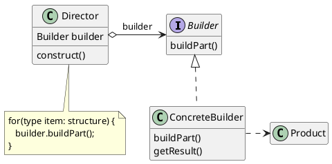

<figcaption>Estrutura Builder com Director.</figcaption>

</figure>

Exemplo da Estrutura Builder **SEM** o Director:

<figure>

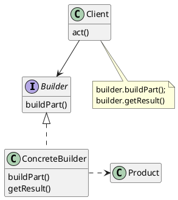

<figcaption>Estrutura Builder sem Director.</figcaption>

</figure>

### Utilização
Builder pode ser utilizado para construir objetos complexos de forma incremental, possibilitando a criação de classes que representam partes do jogo, como o tabuleiro, e também ajuda a configurar as caracteristicas iniciais. 

Este padrão permitirá a construção do jogo de forma flexível e modular, adicionando caracteristicas conforme necessário.

O código abaixo utiliza do padrão builder **SEM** o Director para realizar as criações do tabuleiro do jogo.


```java
public interface GameBoardBuilder {
    void setSize(int size);
    void setPattern(Pattern pattern)
    Board getBoard();
}
```

```java
public class SquareWoodBoardBuilder implements GameBoardBuilder {
    private Board board;
    private int size;
    private Pattern pattern;

    @Override
    void setSize(int size){   
        this.size = size;
    }

    @Override
    void setPattern(Pattern pattern)
    {
        this.pattern = pattern;
    }

    @Override
    public Board getBoard() {
        return Board.getInstance(size, size, pattern, new BoardSquare(), new BoardWood());
    }
}
```

Com essas implementações, este seria o código cliente utilizando o framework:

```java
public class Client {
    public static void main(String[] args) {
        // Isto porque o código cliente sabe qual o builder correto a 
        //ser utilizado para gerar um produto específico.
        GameBoardBuilder builder = new SquareBoardBuilder();

        builder.setSize(8);
        builder.setPattern(new ChessPattern())

        Board board = builder.getBoard();

        // ..Faz algo com o board
    }
}
```

Com isso, o padrão builder ajuda a flexibilizar a construção dos tabuleiros no framework.

### Participantes

- **Builder** (GameBoardBuilder)
    - define uma interface com as configurações em comum para todos os objetos que são baseados nesse Builder. o cliente usa esta interface para chamar o método definido por uma instância de Builder.
- **ConcreteBuilder** (SquareWoodBoardBuilder)
    - implementa métodos para a construção e montagem em partes do produto, usando a interface de Builder.
    - Não expõe o produto durante a montagem, mantém a representação até o objeto ser recuperado.
    - Instâncias concretas de Builder devem fornecer seus próprios métodos para recuperar os resultados de construções, já que os produtos gerados podem ser completamente diferentes.

- **Product** (Board)
    - representa o objeto complexo em construção. O builder constrói a representação interna do produto e define o as etapas de montagem.
    - inclui classes que definem as diversas partes que constituem o objeto complexo, inclusive as interfaces para a montagem das partes no resultado final.


## Prototype


### Intenção
Especificar os tipos de objetos a serem criados usando uma instância-protótipo e criar novos objetos pela cópia desse protótipo.


### Estrutura
<figure>

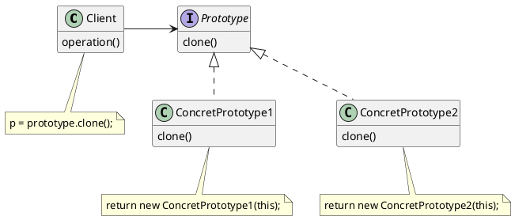

<figcaption>Estrutura Prototype</figcaption>
</figure>

### Utilização
Prototype trabalha para evitar a construção repetida de objetos que necessitam ser construídos várias vezes, como as peças de cada jogador no começo do jogo, ou também ser utilizado como mecânica de jogo no conceito de clones de objetos.

No exemplo a seguir, Prototype ajuda a clonar um peão que já foi criado, para poupar processamento.

Primeiro é preciso definir a abstração da classe:

```java
public abstract class Piece {
    // Atributos padrão.
    Player owner;
    Color color;
    int value;
    //.. outros atributos
    
    public Piece(){}

    public Piece(Piece target){
        if (target != null) {
            this.owner = target.owner;
            this.color = target.color;
            this.value = target.value;

            //.. associação de outros atributos
        }
    }

    public abstract Piece clone();

    @Override
    public boolean equals(Object object2){
        if (!(object2 instanceof Piece)) return false;
        Piece piece2 = (Piece) object2;
        return Player.equals(piece2.owner, owner) && Color.equals(piece2.color, color) && piece2.value == value;
    }
}
```
Logo após é possivel estender:

```java
public class Pawn extends Piece {
    // Atributos específicos da classe...
    boolean promoted;
    // ... Outros atributos  

    public Pawn(){}

    public Pawn(Pawn target){
        // Alimenta os atributos padrão da classe pai.
        super(target);

        if (target != null) {
            this.promoted = target.promoted;
            //.. Associação de outros atributos específicos
        }
    }

    @Override
    public Pawn clone(){
        return new Pawn(this);
    };

    @Override
    public boolean equals(Object object2){
        if (!(object2 instanceof Pawn) || !super.equals(object2)) return false;
        Pawn piece2 = (Pawn) object2;
        return piece2.promoted == promoted;
    }
}
```

Com isso, caso seja necessário clonar o objeto ```Pawn``` será possivel através do método ```clone()```, como mostrado abaixo:

```java
public class Client {

    public static void main(String[] args) {
        Pawn firstPawn = new Pawn();

        firstPawn.value = 1;
        firstPawn.color = Colors.White;

        // Cliente cria um peão no passado e 
        // então utiliza da clonagem para acelerar o processo de criação.
        Pawn otherPawn = (Pawn) firstPawn.clone();

        // ..Faz algo com os peões
    }
}

```

Dessa maneira, qualquer peça que estiver estendendo corretamente de ```Piece``` (como no caso do peão) tem a facilidade do método clone para auxiliar em casos de multiplas instâncias idênticas.

### Participantes

- **Prototype** (Piece)
    - declara uma interface para clonar a si próprio.

- **ConcretePrototype** (Pawn)
    - implementa uma operação para clonar a si próprio.

- **Client** (Client)
    - cria um novo objeto solicitando a um protótipo que clone a si próprio.


## Strategy 

### Intenção
Permite a definição de uma família de algoritmos e coloque-os em classes separadas, variando o algoritmo independentemente dos clientes que o utilizam.

### Estrutura
<figure>

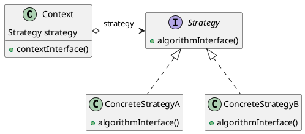

<figcaption>Estrutura Strategy.</figcaption>
</figure>


### Utilização
Strategy entra como uma forma de gerenciar os comportamentos no jogo, como nas ações das peças do jogo de tabuleiro em casos especificados.

A seguir vamos entender como o padrão pode ajudar a implementar comportamentos como o movimento das peças do jogo.


Definição da interface Strategy:
```java
public interface MovementStrategy {
    boolean move(Movement movement)
}
```

Com esta definição é possivel implementar a estrategia de movimento de uma peça, como no exemplo abaixo:

```java
public class HorseMovement implements MovementStrategy {
    public HorseMovement(){}

    @Override
    boolean move(Movement movement){
        int deltaX = Math.abs(oldLocation.x - newLocation.x);
        int deltaY = Math.abs(oldLocation.y - newLocation.y);

        // Verifica se o movimento é em "L", que é o respectivo movimento do cavalo
        if ((deltaX == 2 && deltaY == 1) || (deltaX == 1 && deltaY == 2)) {

            // ... faz verificações de outras informações dentro da classe Movement

            return true;
        } else {
            return false;
        }
    }
}
```
O código cliente então, consegue utilizar das estrategias implementadas:
```java
public class Client {
    // Cliente assumindo o papel do que o Chain Of Responsability faz.
    // Neste caso seria o Handler -> HorseMovementHandler();

    public boolean handleRequest(MovePieceCommand movePieceCommand) {
        if(!(movePieceCommand.movement.piece instance of Horse)){
            return nextHandler.handleRequest(movePieceCommand);
        }
        //... Realiza verificações de tipagem

        // Utiliza o strategy correto para verificar o movimento
        // que está presente no comando.
        boolean result = movementStrategy.move(movePieceCommand.movement);

        // A resposta indica se o movimento pode ser realizado.
        if(result){
            movePieceCommand.execute();
            return true;
        }

        return false;
    }
}

```
Strategy trabalha em conjunto com o padrão **Chain Of Responsability** que direciona qual objeto Strategy deve tratar a solicitação, que é feita através de comandos (do padrão **Command**).

### Participantes

- **Strategy** (MovementStrategy)
    - define uma interface comum para todos os algoritmos suportados. Context usa esta interface para chamar o algoritmo definido por instância Strategy.

- **ConcreteStrategy** (HorseMovement)
    - implementa o algoritmo usando a interface de Strategy.

- **Context** (Client)
    - é configurado com um objeto Strategy.
    - mantém uma referência para um objeto Strategy.
    - pode definir uma interface que permite a Strategy acessar seus dados.


## State

### Intenção
A intenção do padrão State é permitir que um objeto altere seu comportamento quando o seu estado interno muda. Isso permite que o objeto pareça ter uma classe diferente em diferentes momentos.

### Estrutura

<figure>

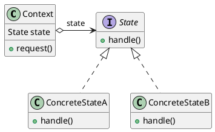

<figcaption>Estrutura State.</figcaption>
</figure>


### Utilização
State é utilizado para definir os estados do jogo, como estado de início, estado de jogo em andamento, estado de finalização e outros estados que serão adicionais através do framework. Isso ajuda a controlar como as ações são executadas em cada estado.

Definimos a classe ```Game``` que é a classe principal do framework:

```java
public class Game{
    // Atribuitos do jogo.
    private GameState state;
    public Board board;
    public List<Player> players;

    // Construtor do jogo.
    Game(){
        this.state = new InitialState();
    }

    public void StartGame(){
        //  ..Define todos os preparativos

        // Inicia o jogo através do estado atual.
        state.start();
    }

    public void EndGame(){
        Player winner;

        for(Player player : players){
            if(player.winner == true){
                winner = player;
                break;
            }
        }

        state.end(winner);
    }

    public GameState getState(){
        return state;
    }

    public void setState(GameState newState){
        this.state = newState;
    }

    //... Outros métodos
}

```
Então se tem a necessidade de guardar os estados do jogo, definimos então a interface GameState:

```java
public abstract class GameState {
    Game game;

    GameState(Game game) {
        this.game = game;
    }

    abstract String start();
    abstract String pause();
    abstract String resume();
    abstract String end(Player winner);
}   
```
Com a interface definida, é possivel fazer a implementação de um estado representativo do jogo:

```java
public class InitialState extends GameState {
    InitialState(Game game){
        super(game);
    }

    @Override 
    public  String start(){
        game.changeState(new PlayingState(game));
        return 'Starting game...';
    };

    @Override
    public String pause(){
        return "Game hasn't started yet";
    }

    @Override
    public String resume(){
        return "Game needs to start first";
    }


    @Override
    public String end(Player winner){
        if(winner == Null ){
            return 'Draw';
        }

        return 'The game has ended, winner :'+winner.name;
    };

}

```

Com isso, é possivel representar os possiveis estados do jogo:

```java
public class Client {
    public static void main(String[] args) {
        // o jogo é criado..
        Game game = new Game();

        // logo após é definido o estado initial do jogo
        game.changeState(new InitialState());

        // ..Faz algo com o game
    }
}

```

### Participantes

- **Context** (Game)
    - define a interface de interesse para os clientes.
    - mantém uma instância de State que define o estado atual.
- **State** (GameState)
    - define uma interface para encapsulamento associado com um determinado estado do Context.
- **ConcreteState** (InitialState)
    - cada subclasse implementa um comportamento associado com um estado do Context.


## Singleton

### Intenção
Garantir que uma classe tenha somente uma instância e fornecer um ponto global de acesso para a mesma.


### Estrutura

<figure> 

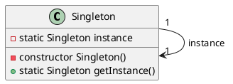

<figcaption>Estrutura Singleton.</figcaption>
</figure>

### Utilização

Singleton é utilizado para garantir que só haja uma unica instância de board no jogo.

```java
public final class Board {
    // Mantém uma instância do mesmo tipo privada.
    private static Board instance;
    public int xSize;
    public int ySize;
    public BoardPattern pattern;
    public BoardFormat format;
    public BoardDrawMaterial material;
    public List<PieceSquare> squares;

    // Mantém o proprio construtor privado.
    private Board() {
        // Valores padrões para construção sem parametros
        this.xSize = 8; 
        this.ySize = 8; 
        this.pattern = new DefaultBoardPattern(); 
        this.format = new BoardSquare(); 
        this.material = new BoardPlastic();

        int squaresLength = (this.xSize * this.ySize);

        squares = this.pattern.getSquares(squaresLength);
    }

    // Mantém o proprio construtor privado.
    // Sobrecarga o construtor com as variaveis sendo definidas.
    private Board(int xSize, int ySize, BoardPattern pattern, BoardFormat format, BoardDrawMaterial material) {
        this.xSize = xSize;
        this.ySize = ySize;
        this.pattern = pattern;
        this.format = format;
        this.material = material;

        int squaresLength = (this.xSize * this.ySize);

        squares = this.pattern.getSquares(squaresLength);
    }

    public static Board getInstance() {
        if (instance == null) {
            instance = new Board();
        }
        return instance;
    }

    public static Board getInstance(int xSize, int ySize, BoardPattern pattern, BoardFormat format, BoardDrawMaterial material) {
        if (instance == null) {
            instance = new Board(xSize, ySize, pattern, format, material);
        }
        return instance;
    }

    public void movePiece(Movement movement){
        //... Método por trás do movimento de uma peça.
    }

    public void addPiece(Piece newPiece, PieceSquare square){
        //... Método por trás da adição de uma peça numa casa.
    }
}

```

Definindo o objeto board desse jeito, garantimos que só existirá uma instância do mesmo.

```java

public class Client {

    public static void main(String[] args) {
        // regasta ou cria a instância de board
        Board board = Board.getInstance();

        // ..Faz algo com o board
    }
}

```
### Participante

- **Singleton** (Board)
    -  define uma função que permite aos clientes acessarem sua única instância.
    -  pode ser responsável pela criação da sua própria instância única.


## Chain of responsability

### Intenção
Evitar o acoplamento do remetente de uma solicitação ao seu receptor, ao dar a mais de um objeto a oportunidade de tratar a solicitação. Encadear os objetos receptores, passando a solicitação ao longo da cadeia até que um objeto a trate.


### Estrutura
<figure>

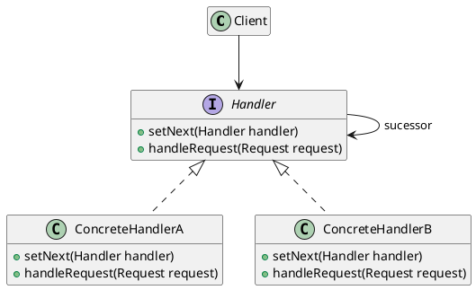

<figcaption> Estrutura Chain of responsability.</figcaption>
</figure>


### Utilização
Chain of responsability será utilizado para tratar os comandos de movimento das peças e atuar em conjunto com o **Strategy**, definindo corretamente qual estrategia deve ser utilizada.


O primeiro passo é definir a interface dos handlers:
```java
public interface MovementHandler{
    void setNext(MovementHandler nextHandler);
    boolean handleRequest(MovePieceCommand movePieceCommand);
}
```

Logo após a definição, vem a implementação dos handlers, como o handler da peça Cavalo :

```java
public class HorseMovementHandler implements MovementHandler {
    private MovementStrategy movementStrategy;
    private MovementHandler nextHandler;

    public HorseMovementHandler(MovementStrategy movementStrategy) {
        this.movementStrategy = movementStrategy;
    }

    public void setNext(MovementHandler nextHandler) {
        this.nextHandler = nextHandler;
    }

    public boolean handleRequest(MovePieceCommand movePieceCommand) {
        if(!(movePieceCommand.movement.piece instance of Horse)){
            return nextHandler.handleRequest(movePieceCommand);
        }

        boolean result = movementStrategy.move(movePieceCommand.movement);

        if(result){
            movePieceCommand.execute();
            return true;
        }

        return false;
    }
}
```

Com isso, temos o código do que seria um cliente:

```java
public class Client {
    public static void main() {
        // ... Faz validações de contexto
        if(!(command instance of MovePieceCommand)){
            return;
        }
        // ... Faz validações de contexto

        //.. cria os strategys 
        HorseMovement horseStrategy = new HorseMovement();
        PawnMovement pawnStrategy = new PawnMovement();

        MovementHandler horseHandler = HorseMovementHandler(horseStrategy);
        horseHandler.setNext(new PawnMovementHandler(pawnStrategy));

        // result indica se a solicitação foi executada ou não pelo strategy.
        result = horseHandler.handleRequest((MovePieceCommand) command);

        // ..Faz algo com o resultado
    }
}
```

### Participantes

- **Handler** (MovementHandler)
    - define uma interface para tratar solicitações.
    - (opcional) implementa o elo (link) ao sucessor.
- **ConcreteHandler** (HorseMovementHandler)
    -  trata de solicitações pelas quais é responsável.
    -  pode acessar seu sucessor.
    -  se o objeto Handler pode tratar a solicitação, ele assim o faz, caso contrário, ele repassa a solicitação para o seu sucessor.

- **Cliente** (Client)
    - inicia a solicitação para um objeto ConcreteHandler da cadeia.


## Command

### Intenção
Encapsular uma solicitação como um objeto, desta forma permitindo parametrizar clientes com diferentes solicitações, enfileirar ou fazer o registro (log) de solicitações e suportar operações que podem ser desfeitas.

### Estrutura

<figure>

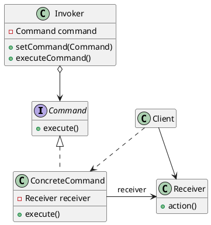

<figcaption> Estrutura Command.</figcaption>
</figure>

### Utilização
Command é uma forma de encapsular as solicitações do jogador em objetos de comando, simplificando o tratamento de requisições.


Primeiro definimos a abstração dos comandos:

```java
public abstract class Command {
    private Board board;

    Command(Board board){
        this.board = board;
        this.movement = movement;
    }  

    void execute();
}
```

Agora é possivel estender:

```java
public class MovePieceCommand extends Command {
    public Movement movement;

    MovePieceCommand(Board board, Movement movement){
        super(board);
        this.movement = movement;
    }
    
    @Override
    public void execute() {
        board.movePiece(movement);
    }
}
```

Com isso, é possivel utilizar o comando, como nesta classe Player que cria o comando e atribui o board:

```java
public class Player(){
    public String name;
    //... Atributos de Player 

    MovePieceCommand MovePiece(Piece piece, Location oldLocation, Location newLocation){
        Movement newMovement = new Movement(piece, oldLocation, newLocation);

        return new MovePieceCommand(Board.getInstance(), newMovement);
    }
}
```
Com a criação do Comando, é possivel prosseguir com a solicitação:

```java
public class Client {
    public void movementRequest(Player playerRequest, Piece piece, Location oldLocation, Location newLocation) {
        // ... Faz validações de contexto
    
        Command newcommand = playerRequest.movePiece(piece, oldLocation, newLocation);

        if(!(command instance of MovePieceCommand)){
           return;
        }

        //... Utiliza os strategys, assim como visto anteriormente
        HorseMovementStrategy horseStrategy = new HorseMovementStrategy();
        PawnMovementStrategy pawnStrategy = new PawnMovementStrategy();

        MovementHandler horseHandler = HorseMovementHandler(horseStrategy);
        horseHandler.setNext(new PawnMovementHandler(pawnStrategy));

        // result indica se a solicitação foi executada ou não pelo strategy.
        result = horseHandler.handleRequest((MovePieceCommand) command);
        
        // ..Faz algo com o resultado
    }
}
```

### Participantes

- **Command** (Command)
    -  declara uma interface para a execução de uma operação.
- **ConcreteCommand** (MovePieceCommand)
    - define uma vinculação entre um objeto Receiver e uma ação.
    - implementa execute através da invocação da(s) correspondente(s) operação(ões) no Receiver.
- **Client** (Player)
    -  cria uma instância de Command e estabelece o seu receptor.
- **Invoker**(Client)
    - solicita ao Command a execução da solicitação.

- **Receiver**(Board)
    - sabe como executar as operações associadas a uma solicitação. Qualquer classe pode funcionar como um Receiver.


## Façade

### Intenção
Fornecer uma interface unificada para um conjunto de interfaces em um subsistema. Façade define uma interface de nível mais alto que torna o subsistema mais fácil de ser usado.

### Estrutura

<figure>

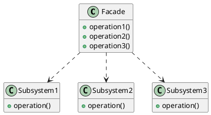

<figcaption>Estrutura Façade.</figcaption>
</figure>

### Utilização
Facade atua como um facilitador entre as classes principais e suas funcionalidades, como a criação das peças e a interação com o tabuleiro, melhorando a interação do código cliente com os recursos oferecidos pelo framework.

No exemplo a seguir o Façade é usado para melhorar a interação com as funcionalidades do jogo.  

```java
public class GameSystem{
    private Game game;
    private List<Player> players;

    GameSystem(){}

    public void buildBoardGame(int playersCount){
        game = new Game();

        // Constroi uma instancia de board padrão para o jogo.
        game.board = Board.getInstance();

        buildPlayers(playersCount);

         // logo após é definido o estado initial do jogo.
        game.changeState(new InitialState());
    }

    private buildPlayers(int players){
        players = ArrayList<Player>();
        for (int i = 1; i < players; i++) {
            players.add(new Player("player "+i));
        }
    }

    public void pauseGame(){
        game.changeState(new PausedState());
    }

    public Game getGame(){
        return game;
    }

    public List<Player> getPlayers(){
        return players;
    }

    //... Outros métodos que façade pode ter
}
```

Com isso, no código cliente é mais fácil utilizar o framework, como:

```java

public class Client {
    public static void main() {
        // Instancia a Façade.
        GameSystem gameSystem = new GameSystem();

        // Utiliza o Façade para construir um jogo com 2 jogadores
        // e também automaticamente define o estado inicial
        gameSystem.buildBoardGame(2);

        // Consegue pausar o jogo sem a necessidade 
        // de saber a interface dos estados.
        gameSystem.pauseGame();

        // ..Continua o código cliente.
    }
}
```

### Participantes

- **Façade** (GameSystem)
    - conhece quais as classes do subsistema são responsáveis pelo atendimento de uma solicitação.
    -  delega solicitações de clientes a objetos apropriados do subsistema.
- **Classes de subsistema** (Game, Player)
    - implementam a funcionalidade do subsistema.
    - encarregam-se do trabalho atribuído a elas pelo objeto Façade.
    - não têm conhecimento da façade, isto é, não mantêm referências para a mesma.


## Mediator

### Intenção
Definir um objeto que encapsula a forma como um conjunto de objetos interage. O Mediator promove o acoplamento fraco ao evitar que os objetos se refiram uns aos outros explicitamente e permite variar suas interações independentemente.

### Estrutura

<figure> 


<figcaption>Estrutura Mediator.</figcaption>
</figure>

### Utilização
Mediator serve como uma breve validação entre comandos, avaliando se o comando realmente deve ser repassado para as classes responsaveis, evitando gastos de processamentos desnecessários.

Como por exemplo, validar se um comando (uma requisição feita através do **Command**), considerando os contextos do jogo, deve ser repassado para as correntes de responsabilidade (**Chain of responsability**).

Ele trabalha em conjunto com o observer, indicando quais ações foram realizadas.

## Observer

### Intenção
Definir uma dependência um-para-muitos entre objetos, de maneira que quando um objeto muda de estado todos os seus dependentes são notificados e atualizados automaticamente.

### Estrutura

<figure>

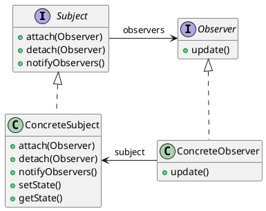

<figcaption>Estrutura Observer. </figcaption>
</figure>


### Utilização
Observer pode ser usado para notificar automaticamente sobre mudança de objetos, ele trabalha em conjunto com as modificações executadas no **Mediator** para garantir que as execuções sejam confirmadas. Isso ajuda a definir quando mudar o estado do jogo considerando o contexto das peças.


## Composite

### Intenção
Compor objetos em estruturas de árvore para representarem hierarquias partes-todo. Composite permite aos clientes tratarem de maneira uniforme objetos individuais e composições de objetos.

### Estrutura
<figure>

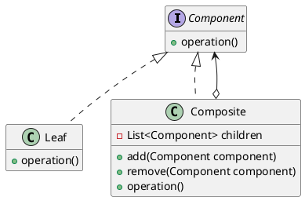
<figcaption>Estrutura Composite.</figcaption>
</figure>

### Utilização
Composite entra como uma forma de organizar os objetos das peças dentro das casas do tabuleiro, o objeto ```Piece``` atua como uma folha dentro de ```SquarePiece```, que é a representação de uma casa no tabuleiro.


## Iterator

### Intenção
Fornecer um meio de acessar, seqüencialmente, os elementos de um objeto agregado sem expor a sua representação subjacente.

### Estrutura

<figure>


<figcaption>Estrutura Iterator.</figcaption>
</figure>

### Utilização
Iterator é útil para percorrer as casas do tabuleiro de forma eficiente, ele trabalha em conjunto com o padrão **Composite**, isso ajuda a agilizar o processo de identificação das peças.


