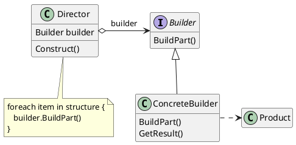
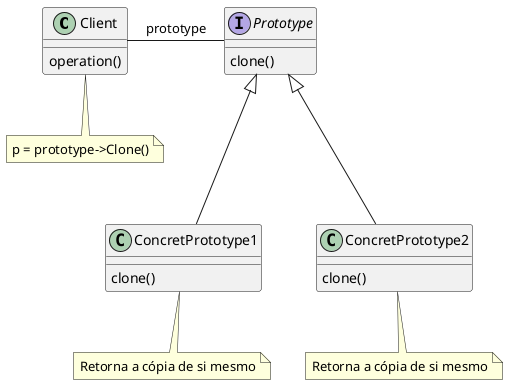
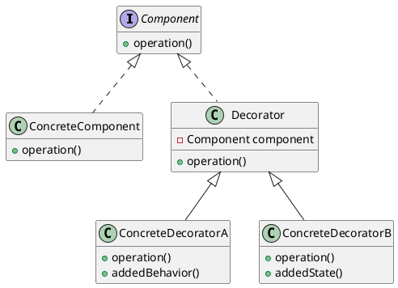
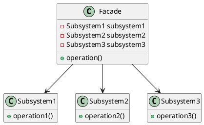
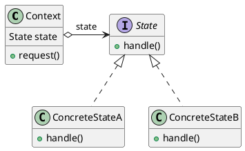
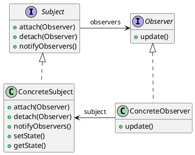
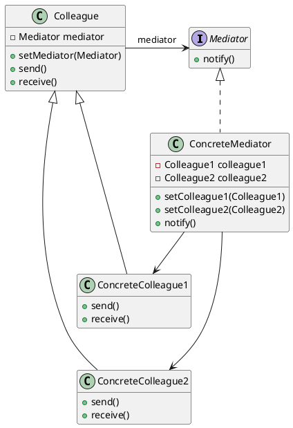
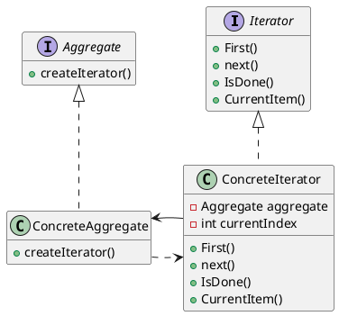
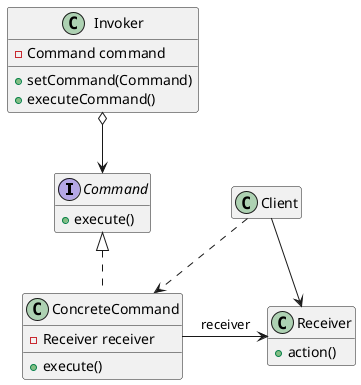

# Gabriel Café - Framework de jogo de tabuleiro 

**Padrões de projeto que serão utilizados neste framework:**

## Builder

### Intenção
Permite a separação da criação de objetos complexos de suas representações, produzindo diferentes tipos e representações do objeto com o mesmo processo de construção.

### Estrutura
O Padrão Builder possui uma estrutura com 4 participantes, como ilustrado abaixo :

<figure>



<figcaption>Estrutura Builder.</figcaption>

</figure>

### Utilização
Builder pode ser utilizado para construir objetos complexos de forma incremental, possibilitando a criação de classes que representam partes do jogo, como o tabuleiro, casas, peças, e também configurando as caracteristicas iniciais. 

Este padrão permitirá a construção do jogo de forma flexível e modular, adicionando os componentes conforme necessário.


```java
public interface GameBoardBuilder {
    void setPlayers(int players);
    void setPieces(int pieces);
    void setDimension(int height, int width);
    void setSquaresPattern();
    Board getBoard();
}
```

```java
public class SquareBoardBuilder implements GameBoardBuilder {
    private Board board;
    private List<Player> players;
    private List<GenericPiece> pieces;
    private Dimension dimension;

    @Override
    public void setPlayers(int players){
        List<Player> newPlayers = [];

        for (int i = 1; i < players; i++){
            newPlayers.add(new Player(i));
        }

        this.players = newPlayers;    
    };


    @Override
    public void setPieces(int pieces){
        //Cria uma peça generica e deixa o trabalho de clonagem para o Prototype
        GenericPiece genericPiece = new GenericPiece();
        //.. parte do Prototype
    };

     @Override
    void setDimension(int height, int width){   
        if(height == width){
            this.dimension = new Dimension(height, width);
        }
    }


    @Override
    public Board getBoard() {
        if(dimension == null){
            dimension = new Dimension(8, 8);
        }

        return new Board(dimension, players, pieces);
    }
}
```

Com essas implementações, este seria o código cliente utilizando o framework:

```java
public class Client {

    public static void main(String[] args) {
        // Isto porque o código cliente sabe qual o builder correto a ser utilizado para gerar um produto específico.
        GameBoardBuilder builder = new SquareBoardBuilder();

        builder.setPlayers(2);
        builder.setPieces(32);
        builder.setDimension(8,8);

        Board board = builder.getBoard();

        // ..Faz algo com o board
    }
}
```

Com isso, o padrão builder ajuda a flexibilizar a construção dos tabuleiros no framework.

## Prototype


### Intenção
Especificar os tipos de objetos a serem criados usando uma instância-protótipo e criar novos objetos pela cópia desse protótipo.


### Estrutura
<figure>



<figcaption>Estrutura Prototype</figcaption>
</figure>

### Utilização
Prototype trabalha por debaixo dos panos em conjunto com o builder, para evitar a construção repetida de objetos que necessitam ser construídos várias vezes, como as peças de cada jogador no começo do jogo, ou também ser utilizado como mecânica de jogo no conceito de clones de objetos.


## Decorator 

### Intenção
Dinamicamente, agregar responsabilidades adicionais a um objeto. Os Decorators fornecem uma alternativa flexível ao uso de subclasses para extensão de funcionalidades.

### Estrutura
<figure>


<figcaption>Estrutura Decorator.</figcaption>
</figure>

### Utilização
Decorator entra como uma forma de adicionar comportamentos adicionais em partes do jogo, como adicionar um novo comportamento à uma peça ou a uma casa do tabuleiro em casos especificados.


## Façade

### Intenção
Fornecer uma interface unificada para um conjunto de interfaces em um subsistema. Façade define uma interface de nível mais alto que torna o subsistema mais fácil de ser usado.

### Estrutura

<figure>




<figcaption>Estrutura Facade</figcaption>
</figure>

### Utilização
Facade atua como um facilitador entre as classes principais e suas funcionalidades, como a criação das peças e a interação com o tabuleiro, melhorando a interação do código cliente com os recursos oferecidos pelo framework.


## State

### Intenção
A intenção do padrão State é permitir que um objeto altere seu comportamento quando o seu estado interno muda. Isso permite que o objeto pareça ter uma classe diferente em diferentes momentos.

### Estrutura

<figure>



<figcaption>Estrutura State.</figcaption>
</figure>


### Utilização
State é utilizado para definir os estados do jogo, como estado de início, estado de jogo em andamento, estado de finalização e outros estados que serão adicionais através do framework. Isso ajuda a controlar quais ações são permitidas em cada estado.


## Observer

### Intenção
Definir uma dependência um-para-muitos entre objetos, de maneira que quando um objeto muda de estado todos os seus dependentes são notificados e atualizados automaticamente.

### Estrutura

<figure>



<figcaption>Estrutura Observer. </figcaption>
</figure>


### Utilização
Observer pode ser usado para notificar automaticamente sobre mudanças de objetos. Isso ajuda a definir quando mudar o estado do jogo considerando o contexto das peças.


## Mediator


### Intenção
Definir um objeto que encapsula a forma como um conjunto de objetos interage. O Mediator promove o acoplamento fraco ao evitar que os objetos se refiram uns aos outros explicitamente e permite variar suas interações independentemente.

### Estrutura

<figure> 



<figcaption>Estrutura Mediator.</figcaption>
</figure>

### Utilização
Mediator se aplica ao verificar se uma ação tomada pelo jogador é válida, permitindo a realização ou rejeitando de acordo com as regas. Ele trabalha em conjunto com o observer, indicando quais ações foram realizadas.


## Iterator

### Intenção
Fornecer um meio de acessar, seqüencialmente, os elementos de um objeto agregado sem expor a sua representação subjacente.

### Estrutura

<figure>


<figcaption>Estrutura Iterator.</figcaption>
</figure>

### Utilização
Iterator é útil para percorrer as casas do tabuleiro de forma eficiente, especialmente para validar o estado atual do jogo.


## Command

### Intenção
Encapsular uma solicitação como um objeto, desta forma permitindo parametrizar clientes com diferentes solicitações, enfileirar ou fazer o registro (log) de solicitações e suportar operações que podem ser desfeitas.

### Estrutura

<figure>



<figcaption> Estrutura Command.</figcaption>
</figure>

### Utilização
Command é uma forma de encapsular as solicitações do jogador em objetos de comando, ele trabalha em conjunto com Mediator para simplificar a passagem de comandos.


